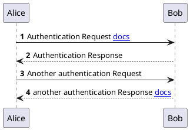

# Example

# Basic



# Import External PUML

# Example 1
```plantuml
@startuml
autonumber

[[!include ./pumls/sample.puml]]

Alice -> Bob: Another authentication Request
Alice <-- Bob: another authentication Response
@enduml
```

# Example 2
```plantuml
[[!include ./pumls/sample2.puml]]
```
