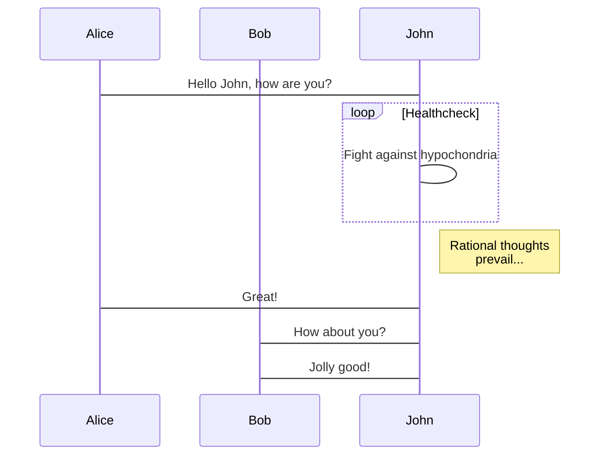
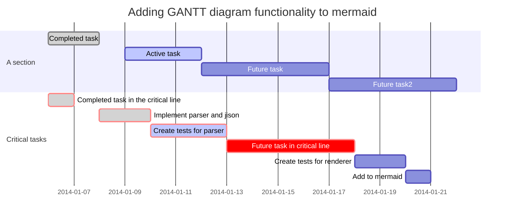

# Markdown in LaTeX should not be rendered

## "em" in LaTeX

`*...*` in LaTeX code should not be italic:

$$
*f(x)* = 5
\tag{1}
$$

`_..._` in LaTeX code should not be italic:

$$
_f(x)_ = 5
\tag{2}
$$

Another example form [docsify#646](https://github.com/docsifyjs/docsify/issues/646):

$\{x_n\}$，$\lim\limits_{n \rightarrow \infty} x_n = a$

## "strong" in LaTeX

`**...**` in LaTeX code should not be bold:

$$
E = **mc^2**
\tag{3}
$$

`__...__` in LaTeX code should not be bold:

$$
E = __mc^2__
\tag{4}
$$

## `\\` support

$$
a = b \\
c = d
$$

So this: $
\def\arraystretch{1.5}
   \begin{array}{c:c:c}
   a & b & c \\ \hline
   d & e & f \\
   \hdashline
   g & h & i
\end{array}
$

## HTML

This URL: $
\href{https://katex.org/}{\KaTeX}
$

## Table

| |
|:-------------------------------------------------------|
|$\displaystyle\sum_{i=1}^n$ `\displaystyle\sum_{i=1}^n`
|$\textstyle\sum_{i=1}^n$ `\textstyle\sum_{i=1}^n`
|$\scriptstyle x$ `\scriptstyle x` &nbsp;&nbsp;&nbsp;&nbsp;&nbsp;&nbsp;&nbsp;&nbsp;(The size of a first sub/superscript)
|$\scriptscriptstyle x$ `\scriptscriptstyle x` (The size of subsequent sub/superscripts)
|$\lim\limits_x$ `\lim\limits_x`
|$\lim\nolimits_x$ `\lim\nolimits_x`
|$\verb!x^2!$ `\verb!x^2!`

## Comments and begin with KaTeX

<!--
bla
bla
bla
-->

$$
a = b
$$

## Special cases

The second argument of `\raisebox` can contain math if it is nested within `$…$` delimiters, as in `\raisebox{0.25em}{$\frac a b$}`

$\left(\LARGE{AB}\right)$ `\left(\LARGE{AB}\right)`

$`$ <code>`</code>

||||
|-|-|-|
|\\_|$\_$||
|\\\`|$\text{\`{a}}$|<code>\text{\\'{a}}</code>|

# mermaid

## Flowchart

## Sequence diagram

## Gantt diagram

# Support table

<!-- copied from https://raw.githubusercontent.com/Khan/KaTeX/master/docs/support_table.md -->

See also: https://katex.org/docs/support_table.html.

This is a list of TeX functions, sorted alphabetically. This list includes functions that KaTeX supports and some that it doesn't support. There is a similar page, with functions [sorted by type](supported.md).

If you know the shape of a character, but not its name, [Detexify](http://detexify.kirelabs.org/classify.html) can help.

## Symbols

|Symbol/Function |  Rendered   | Source or Comment|
|:---------------|:------------|:-----------------|
|\!|$n!$|`n!`|
|\\\!|$a\!b$|`a\!b`|
|#|$\def\bar#1{#1^2} \bar{y}$|`\def\bar#1{#1^2} \bar{y}`|
|\\#|$\#$||
|%||`%this is a comment`|
|\\%|$\%$||
|&|$\begin{matrix} a & b\cr c & d \end{matrix}$|`\begin{matrix}` &nbsp;&nbsp;&nbsp;`a & b \\` &nbsp;&nbsp;&nbsp;`c & d` `\end{matrix}`|
|\\&|$\&$||
|'|$'$||
|\\\'|$\text{\'{a}}$|`\text{\'{a}}`|
|(|$($||
|)|$)$||
|\\\(…\\\)|$\text{\(\frac a b\)}$|`\text{\(\frac a b\)}`|
|\\ |$a\ b$|`a\ b`|
|\\"|$\text{\"{a}}$|`\text{\"{a}}`|
|\\$|$\text{\textdollar}$||
|\\,|$a\,\,{b}$|`a\,\,{b}`|
|\\.|$\text{\.{a}}$|`\text{\.{a}}`|
|\\:|$a\:\:{b}$|`a\:\:{b}`|
|\\;|$a\;\;{b}$|a`\;\;{b}`|
|_|$x_i$|`x_i`|
|\\_|$\_$||
|\\<code>`</code>|$\text{\`{a}}$|<code>\text{\\'{a}}</code>|
|&#060;|$<$||
|\\=|$\text{\={a}}$|`\text{\\={a}}`|
| >|$>$||
|\\>|$a\>\>{b}$|`a\>\>{b}`|
|\[|$[$||
|\]|$]$||
|{|${a}$|`{a}`|
|}|${a}$|`{a}`|
|\\{|$\{$||
|\\}|$\}$||
|&#124;|$\vert$||
|\\&#124;|$\Vert$||
|~|$\text{no~no~no~breaks}$|`\text{no~no~no~breaks}`|
|\\~|$\text{\~{a}}$|`\text{\\~{a}}`|
|\\\\|$\begin{matrix} a & b\\ c & d\end{matrix}$|`\begin{matrix}` &nbsp;&nbsp;&nbsp;`a & b \\` &nbsp;&nbsp;&nbsp;`c & d` `\end{matrix}`|
|^|$x^i$|`x^i`|
|\\^|$\text{\^{a}}$|`\text{\\^{a}}`|

## A

|Symbol/Function |  Rendered   | Source or Comment|
|:---------------|:------------|:-----------------|
|\AA|$\text{\AA}$|`\text{\AA}`|
|\aa|$\text{\aa}$|`\text{\aa}`|
|\above|${a \above{2pt} b+1}$|`{a \above{2pt} b+1}`|
|\abovewithdelims|Not supported||
|\acute|$\acute e$|`\acute e`|
|\AE|$\text{\AE}$|`\text{\AE}`|
|\ae|$\text{\ae}$|`\text{\ae}`|
|\alef|$\alef$||
|\alefsym|$\alefsym$||
|\aleph|$\aleph$||
|{align}|Not supported|see `{aligned}`|
|{aligned}|$\begin{aligned}a&=b+c\\d+e&=f\end{aligned}$|`\begin{aligned}` &nbsp;&nbsp;&nbsp;`a&=b+c \\` &nbsp;&nbsp;&nbsp;`d+e&=f` `\end{aligned}`|
|{alignat}|Not supported|see `{alignedat}`|
|{alignedat}|$\begin{alignedat}{2}10&x+&3&y=2\\3&x+&13&y=4\end{alignedat}$|`\begin{alignedat}{2}` &nbsp;&nbsp;&nbsp;`10&x+ &3&y = 2 \\` &nbsp;&nbsp;&nbsp;` 3&x+&13&y = 4` `\end{alignedat}`|
|\allowbreak|||
|\Alpha|$\Alpha$||
|\alpha|$\alpha$||
|\amalg|$\amalg$||
|\And|$\And$||
|\and|Not supported|[Deprecated](https://en.wikipedia.org/wiki/Help:Displaying_a_formula#Deprecated_syntax)|
|\ang|Not supported|[Deprecated](https://en.wikipedia.org/wiki/Help:Displaying_a_formula#Deprecated_syntax)|
|\angl|Not supported||
|\angle|$\angle$||
|\approx|$\approx$||
|\approxeq|$\approxeq$||
|\arccos|$\arccos$||
|\arcctg|$\arcctg$||
|\arcsin|$\arcsin$||
|\arctan|$\arctan$||
|\arctg|$\arctg$||
|\arg|$\arg$||
|\argmax|$\argmax$||
|\argmin|$\argmin$||
|{array}|$\begin{array}{cc}a&b\\c&d\end{array}$ | `\begin{array}{cc}` &nbsp;&nbsp;&nbsp;`a & b \\` &nbsp;&nbsp;&nbsp;`c & d` `\end{array}`|
|\array|Not supported|see `{array}`|
|\arraystretch|$\def\arraystretch{1.5}\begin{array}{cc}a&b\\c&d\end{array}$|`\def\arraystretch{1.5}` `\begin{array}{cc}` &nbsp;&nbsp;&nbsp;`a & b \\` &nbsp;&nbsp;&nbsp;`c & d` `\end{array}`|
|\Arrowvert|Not supported||
|\arrowvert|Not supported||
|\ast|$\ast$||
|\asymp|$\asymp$||
|\atop|${a \atop b}$|`{a \atop b}`|
|\atopwithdelims|Not supported||

## B

|Symbol/Function |  Rendered   | Source or Comment|
|:---------------|:------------|:-----------------|
|\backepsilon|$\backepsilon$||
|\backprime|$\backprime$||
|\backsim|$\backsim$||
|\backsimeq|$\backsimeq$||
|\backslash|$\backslash$||
|\bar|$\bar{y}$|`\bar{y}`|
|\barwedge|$\barwedge$||
|\Bbb|$\Bbb{ABC}$|`\Bbb{ABC}` KaTeX supports A-Z & k|
|\Bbbk|$\Bbbk$||
|\bbox|Not supported||
|\bcancel|$\bcancel{5}$|`\bcancel{5}`|
|\because|$\because$||
|\begin|$\begin{matrix} a & b\\ c & d\end{matrix}$|`\begin{matrix}` &nbsp;&nbsp;&nbsp;`a & b \\` &nbsp;&nbsp;&nbsp;`c & d` `\end{matrix}`|
|\begingroup|$\begingroup a}$|`\begingroup a}`|
|\Beta|$\Beta$||
|\beta|$\beta$||
|\beth|$\beth$||
|\between|$\between$||
|\bf|$\bf AaBb12$|`\bf AaBb12`|
|\bfseries|Not supported||
|\big|$\big(\big)$|`\big(\big)`|
|\Big|$\Big(\Big)$|`\Big(\Big)`|
|\bigcap|$\bigcap$||
|\bigcirc|$\bigcirc$||
|\bigcup|$\bigcup$||
|\bigg|$\bigg(\bigg)$|`\bigg(\bigg)`|
|\Bigg|$\Bigg(\Bigg)$|`\Bigg(\Bigg)`|
|\biggl|$\biggl($|`\biggl(`|
|\Biggl|$\Biggl($|`\Biggl(`|
|\biggm|$\biggm\vert$|`\biggm\vert`|
|\Biggm|$\Biggm\vert$|`\Biggm\vert`|
|\biggr|$\biggr)$|`\biggr)`|
|\Biggr|$\Biggr)$|`\Biggr)`|
|\bigl|$\bigl($|`\bigl(`|
|\Bigl|$\Bigl($|`\Bigl(`|
|\bigm|$\bigm\vert$|`\bigm\vert`|
|\Bigm|$\Bigm\vert$|`\Bigm\vert`|
|\bigodot|$\bigodot$||
|\bigominus|Not supported|[Issue #1222](https://github.com/KaTeX/KaTeX/issues/1222)|
|\bigoplus|$\bigoplus$||
|\bigoslash|Not supported|[Issue #1222](https://github.com/KaTeX/KaTeX/issues/1222)|
|\bigotimes|$\bigotimes$||
|\bigr|$\bigr)$|`\bigr)`|
|\Bigr|$\Bigr)$|`\Bigr)`|
|\bigsqcap|Not supported|[Issue #1222](https://github.com/KaTeX/KaTeX/issues/1222)|
|\bigsqcup|$\bigsqcup$||
|\bigstar|$\bigstar$||
|\bigtriangledown|$\bigtriangledown$||
|\bigtriangleup|$\bigtriangleup$||
|\biguplus|$\biguplus$||
|\bigvee|$\bigvee$||
|\bigwedge|$\bigwedge$||
|\binom|$\binom n k$|`\binom n k`|
|\blacklozenge|$\blacklozenge$||
|\blacksquare|$\blacksquare$||
|\blacktriangle|$\blacktriangle$||
|\blacktriangledown|$\blacktriangledown$||
|\blacktriangleleft|$\blacktriangleleft$||
|\blacktriangleright|$\blacktriangleright$||
|\bm|$\bm{AaBb}$|`\bm{AaBb}`|
|{Bmatrix}|$\begin{Bmatrix}a&b\\c&d\end{Bmatrix}$|`\begin{Bmatrix}` &nbsp;&nbsp;&nbsp;`a & b \\` &nbsp;&nbsp;&nbsp;`c & d` `\end{Bmatrix}`|
|{bmatrix}|$\begin{bmatrix}a&b\\c&d\end{bmatrix}$|`\begin{bmatrix}` &nbsp;&nbsp;&nbsp;`a & b \\` &nbsp;&nbsp;&nbsp;`c & d` `\end{bmatrix}`|
|\bmod|$a \bmod b$|`a \bmod b`|
|\bold|$\bold{AaBb123}$|`\bold{AaBb123}`|
|\boldsymbol|$\boldsymbol{AaBb}$|`\boldsymbol{AaBb}`|
|\bot|$\bot$||
|\bowtie|$\bowtie$||
|\Box|$\Box$||
|\boxdot|$\boxdot$||
|\boxed|$\boxed{ab}$|`\boxed{ab}`|
|\boxminus|$\boxminus$||
|\boxplus|$\boxplus$||
|\boxtimes|$\boxtimes$||
|\Bra|$\left\langle\psi\right\|$|`\Bra{\psi}`|
|\bra|$\mathinner{\langle{\psi}\|}$|`\bra{\psi}`|
|\braket|$\mathinner{\langle{\phi\|\psi}\rangle}$|`\braket{\phi|\psi}`|
|\brace|${n\brace k}$|`{n\brace k}`|
|\bracevert|Not supported||
|\brack|${n\brack k}$|`{n\brack k}`|
|\breve|$\breve{eu}$|`\breve{eu}`|
|\buildrel|Not supported||
|\bull|$\bull$||
|\bullet|$\bullet$||
|\Bumpeq|$\Bumpeq$||
|\bumpeq|$\bumpeq$||

## C

|Symbol/Function |  Rendered   | Source or Comment|
|:---------------|:------------|:-----------------|
|\C|Not supported|[Deprecated](https://en.wikipedia.org/wiki/Help:Displaying_a_formula#Deprecated_syntax)|
|\cal|$\cal AaBb123$|`\cal AaBb123`|
|\cancel|$\cancel{5}$|`\cancel{5}`|
|\cancelto|Not supported||
|\Cap|$\Cap$||
|\cap|$\cap$||
|{cases}|$\begin{cases}a&\text{if }b\\c&\text{if }d\end{cases}$|`\begin{cases}` &nbsp;&nbsp;&nbsp;`a &\text{if } b  \\` &nbsp;&nbsp;&nbsp;`c &\text{if } d` `\end{cases}`|
|\cases|Not supported|see `{cases}`|
|{CD}|Not supported||
|\cdot|$\cdot$||
|\cdotp|$\cdotp$||
|\cdots|$\cdots$||
|\ce |${\mathrm{C}{\vphantom{X}}_{\smash[t]{6}}\mathrm{H}{\vphantom{X}}_{\smash[t]{5}}{-}\mathrm{CHO}}$   $\ce{C6H5-CHO}$ | `{\mathrm{C}{\vphantom{X}}_{\smash[t]{6}}\mathrm{H}{\vphantom{X}}_{\smash[t]{5}}{-}\mathrm{CHO}}`   or `\ce{C6H5-CHO}` Requires an [extension](https://github.com/KaTeX/KaTeX/tree/master/contrib/mhchem/)|
|\cee|Not supported|Deprecated by mhchem
|\centerdot|$a\centerdot b$|`a\centerdot b`|
|\cf|Not supported|Deprecated by mhchem;
use `\ce` instead|
|\cfrac|$\cfrac{2}{1+\cfrac{2}{1+\cfrac{2}{1}}}$|`\cfrac{2}{1+\cfrac{2}{1+\cfrac{2}{1}}}`|
|\check|$\check{oe}$|`\check{oe}`|
|\ch|$\ch$||
|\checkmark|$\checkmark$||
|\Chi|$\Chi$||
|\chi|$\chi$||
|\choose|${n+1 \choose k+2}$|`{n+1 \choose k+2}`|
|\circ|$\circ$||
|\circeq|$\circeq$||
|\circlearrowleft|$\circlearrowleft$||
|\circlearrowright|$\circlearrowright$||
|\circledast|$\circledast$||
|\circledcirc|$\circledcirc$||
|\circleddash|$\circleddash$||
|\circledR|$\circledR$||
|\circledS|$\circledS$||
|\class|Not supported|A PR is pending.
|\cline|Not supported|[Issue #269](https://github.com/KaTeX/KaTeX/issues/269)|
|\clubs|$\clubs$||
|\clubsuit|$\clubsuit$||
|\cnums|$\cnums$||
|\colon|$\colon$||
|\Colonapprox|$\Colonapprox$||
|\colonapprox|$\colonapprox$||
|\Coloneq|$\Coloneq$||
|\coloneq|$\coloneq$||
|\Coloneqq|$\Coloneqq$||
|\coloneqq|$\coloneqq$||
|\Colonsim|$\Colonsim$||
|\colonsim|$\colonsim$||
|\color|$\color{#0000FF} AaBb123$|`\color{#0000FF} AaBb123`|
|\colorbox|$\colorbox{red}{Black on red}$|`\colorbox{red}{Black on red}`|
|\complement|$\complement$||
|\Complex|$\Complex$||
|\cong|$\cong$||
|\Coppa|Not supported||
|\coppa|Not supported||
|\coprod|$\coprod$||
|\copyright|$\copyright$||
|\cos|$\cos$||
|\cosec|$\cosec$||
|\cosh|$\cosh$||
|\cot|$\cot$||
|\cotg|$\cotg$||
|\coth|$\coth$||
|\cr|$\begin{matrix} a & b\cr c & d \end{matrix}$|`\begin{matrix}` &nbsp;&nbsp;&nbsp;`a & b \cr` &nbsp;&nbsp;&nbsp;`c & d` `\end{matrix}`|
|\csc|$\csc$||
|\cssId|Not supported|A PR is pending.
|\ctg|$\ctg$||
|\cth|$\cth$||
|\Cup|$\Cup$||
|\cup|$\cup$||
|\curlyeqprec|$\curlyeqprec$||
|\curlyeqsucc|$\curlyeqsucc$||
|\curlyvee|$\curlyvee$||
|\curlywedge|$\curlywedge$||
|\curvearrowleft|$\curvearrowleft$||
|\curvearrowright|$\curvearrowright$||

## D

|Symbol/Function |  Rendered   | Source or Comment|
|:---------------|:------------|:-----------------|
|\dag|$\dag$||
|\Dagger|$\Dagger$||
|\dagger|$\dagger$||
|\daleth|$\daleth$||
|\Darr|$\Darr$||
|\dArr|$\dArr$||
|\darr|$\darr$||
{darray}|$\begin{darray}{cc}a&b\\c&d\end{darray}$ | `\begin{darray}{cc}` &nbsp;&nbsp;&nbsp;`a & b \\` &nbsp;&nbsp;&nbsp;`c & d` `\end{darray}`|
|\dashleftarrow|$\dashleftarrow$||
|\dashrightarrow|$\dashrightarrow$||
|\dashv|$\dashv$||
|\dbinom|$\dbinom n k$|`\dbinom n k`|
|\dblcolon|$\dblcolon$||
|{dcases}|$\begin{dcases}a&\text{if }b\\c&\text{if }d\end{dcases}$|`\begin{dcases}` &nbsp;&nbsp;&nbsp;`a &\text{if } b  \\` &nbsp;&nbsp;&nbsp;`c &\text{if } d` `\end{dcases}`|
|\ddag|$\ddag$||
|\ddagger|$\ddagger$||
|\ddddot|Not supported||
|\dddot|Not supported||
|\ddot|$\ddot x$|`\ddot x`|
|\ddots|$\ddots$||
|\DeclareMathOperator|Not supported||
|\def|$\def\foo{x^2} \foo + \foo$|`\def\foo{x^2} \foo + \foo`|
|\definecolor|Not supported|[Issue #750](https://github.com/KaTeX/KaTeX/issues/750)|
|\deg|$\deg$||
|\degree|$\degree$||
|\delta|$\delta$||
|\Delta|$\Delta$||
|\det|$\det$||
|\Digamma|Not supported||
|\digamma|$\digamma$||
|\dfrac|$\dfrac{a-1}{b-1}$|`\dfrac{a-1}{b-1}`|
|\diagdown|$\diagdown$||
|\diagup|$\diagup$||
|\Diamond|$\Diamond$||
|\diamond|$\diamond$||
|\diamonds|$\diamonds$||
|\diamondsuit|$\diamondsuit$||
|\dim|$\dim$||
|\displaylines|Not supported||
|\displaystyle|$\displaystyle\sum_0^n$|`\displaystyle\sum_0^n`|
|\div|$\div$||
|\divideontimes|$\divideontimes$||
|\dot|$\dot x$|`\dot x`|
|\Doteq|$\Doteq$||
|\doteq|$\doteq$||
|\doteqdot|$\doteqdot$||
|\dotplus|$\dotplus$||
|\dots|$x_1 + \dots + x_n$|`x_1 + \dots + x_n`|
|\dotsb|$x_1 +\dotsb + x_n$|`x_1 +\dotsb + x_n`|
|\dotsc|$x,\dotsc,y$|`x,\dotsc,y`|
|\dotsi|$$\int_{A_1}\int_{A_2}\dotsi$$|`\int_{A_1}\int_{A_2}\dotsi`|
|\dotsm|$x_1 x_2 \dotsm x_n$|`$x_1 x_2 \dotsm x_n`|
|\dotso|$\dotso$||
|\doublebarwedge|$\doublebarwedge$||
|\doublecap|$\doublecap$||
|\doublecup|$\doublecup$||
|\Downarrow|$\Downarrow$||
|\downarrow|$\downarrow$||
|\downdownarrows|$\downdownarrows$||
|\downharpoonleft|$\downharpoonleft$||
|\downharpoonright|$\downharpoonright$||
|{drcases}|$\begin{drcases}a&\text{if }b\\c&\text{if }d\end{drcases}$|`\begin{drcases}` &nbsp;&nbsp;&nbsp;`a &\text{if } b  \\` &nbsp;&nbsp;&nbsp;`c &\text{if } d` `\end{drcases}`|

## E

|Symbol/Function |  Rendered   | Source or Comment|
|:---------------|:------------|:-----------------|
|\edef|$\def\foo{a}\edef\bar{\foo}\def\foo{}\bar$|`\def\foo{a}\edef\bar{\foo}\def\foo{}\bar`|
|\ell|$\ell$||
|\else|Not supported|[Issue #1003](https://github.com/KaTeX/KaTeX/issues/1003)|
|\em|Not supported||
|\emph|Not supported||
|\empty|$\empty$||
|\emptyset|$\emptyset$||
|\enclose|Not supported|Non standard
|\end|$\begin{matrix} a & b\\ c & d\end{matrix}$|`\begin{matrix}` &nbsp;&nbsp;&nbsp;`a & b \\` &nbsp;&nbsp;&nbsp;`c & d` `\end{matrix}`|
|\endgroup|${a\endgroup$|`{a\endgroup`|
|\enspace|$a\enspace b$|`a\enspace b`|
|\Epsilon|$\Epsilon$||
|\epsilon|$\epsilon$||
|\eqalign|Not supported||
|\eqalignno|Not supported||
|\eqcirc|$\eqcirc$||
|\Eqcolon|$\Eqcolon$||
|\eqcolon|$\eqcolon$||
|{equation}|Not supported|[Issue #445](https://github.com/KaTeX/KaTeX/issues/445)|
|{eqnarray}|Not supported||
|\Eqqcolon|$\Eqqcolon$||
|\eqqcolon|$\eqqcolon$||
|\eqref|Not supported|[Issue #350](https://github.com/KaTeX/KaTeX/issues/350)|
|\eqsim|$\eqsim$||
|\eqslantgtr|$\eqslantgtr$||
|\eqslantless|$\eqslantless$||
|\equiv|$\equiv$||
|\Eta|$\Eta$||
|\eta|$\eta$||
|\eth|$\eth$||
|\euro|Not supported||
|\exist|$\exist$||
|\exists|$\exists$||
|\exp|$\exp$||
|\expandafter|||

## F

|Symbol/Function |  Rendered   | Source or Comment|
|:---------------|:------------|:-----------------|
|\fallingdotseq|$\fallingdotseq$||
|\fbox|$\fbox{Hi there!}$|`\fbox{Hi there!}`|
|\fcolorbox|$\fcolorbox{red}{aqua}{A}$|`\fcolorbox{red}{aqua}{A}`|
|\fi|Not supported|[Issue #1003](https://github.com/KaTeX/KaTeX/issues/1003)|
|\Finv|$\Finv$||
|\flat|$\flat$||
|\footnotesize|$\footnotesize footnotesize$|`\footnotesize footnotesize`|
|\forall|$\forall$||
|\frac|$\frac a b$|`\frac a b`|
|\frak|$\frak{AaBb}$|`\frak{AaBb}`|
|\frown|$\frown$||
|\futurelet|||

## G

|Symbol/Function |  Rendered   | Source or Comment|
|:---------------|:------------|:-----------------|
|\Game|$\Game$||
|\Gamma|$\Gamma$||
|\gamma|$\gamma$||
|{gather}|Not supported|see `{gathered}`|
|{gathered}|$\begin{gathered}a=b\\e=b+c\end{gathered}$|`\begin{gathered}` &nbsp;&nbsp;&nbsp;`a=b \\ ` &nbsp;&nbsp;&nbsp;`e=b+c` `\end{gathered}`|
|\gcd|$\gcd$||
|\gdef|$\gdef\bar#1{#1^2} \bar{y} + \bar{y}$|`\gdef\bar#1{#1^2} \bar{y} + \bar{y}`|
|\ge|$\ge$||
|\geneuro|Not supported||
|\geneuronarrow|Not supported||
|\geneurowide|Not supported||
|\genfrac|$\genfrac ( ] {2pt}{0}a{a+1}$|`\genfrac ( ] {2pt}{0}a{a+1}`|
|\geq|$\geq$||
|\geqq|$\geqq$||
|\geqslant|$\geqslant$||
|\gets|$\gets$||
|\gg|$\gg$||
|\ggg|$\ggg$||
|\gggtr|$\gggtr$||
|\gimel|$\gimel$||
|\global|$\global\def\add#1#2{#1+#2} \add 2 3$|`\global\def\add#1#2{#1+#2} \add 2 3`|
|\gnapprox|$\gnapprox$||
|\gneq|$\gneq$||
|\gneqq|$\gneqq$||
|\gnsim|$\gnsim$||
|\grave|$\grave{eu}$|`\grave{eu}`|
|\gt|$a \gt b$|`a \gt b`|
|\gtrdot|$\gtrdot$||
|\gtrapprox|$\gtrapprox$||
|\gtreqless|$\gtreqless$||
|\gtreqqless|$\gtreqqless$||
|\gtrless|$\gtrless$||
|\gtrsim|$\gtrsim$||
|\gvertneqq|$\gvertneqq$||

## H

|Symbol/Function |  Rendered   | Source or Comment|
|:---------------|:------------|:-----------------|
|\H|$\text{\H{a}}$|`\text{\H{a}}`|
|\Harr|$\Harr$||
|\hArr|$\hArr$||
|\harr|$\harr$||
|\hat|$\hat{\theta}$|`\hat{\theta}`|
|\hbar|$\hbar$||
|\hbox|Not supported||
|\hdashline|$\begin{matrix}a&b\\ \hdashline c &d\end{matrix}$|`\begin{matrix}` &nbsp;&nbsp;&nbsp;`a & b \\` &nbsp;&nbsp;&nbsp;`\hdashline` &nbsp;&nbsp;&nbsp;`c & d` `\end{matrix}`|
|\hearts|$\hearts$||
|\heartsuit|$\heartsuit$||
|\hfil|Not supported||
|\hfill|Not supported|Issues [#164](https://github.com/KaTeX/KaTeX/issues/164) & [#269](https://github.com/KaTeX/KaTeX/issues/269)|
|\hline|$\begin{matrix}a&b\\ \hline c &d\end{matrix}$|`\begin{matrix}` &nbsp;&nbsp;&nbsp;`a & b \\ \hline` &nbsp;&nbsp;&nbsp;`c & d` `\end{matrix}`|
|\hom|$\hom$||
|\hookleftarrow|$\hookleftarrow$||
|\hookrightarrow|$\hookrightarrow$||
|\hphantom|$a\hphantom{bc}d$|`a\hphantom{bc}d`|
|\href|$\href{https://katex.org/}{\KaTeX}$|`\href{https://katex.org/}{\KaTeX}` Requires `trust` [option](options.md)|
|\hskip|$w\hskip1em i\hskip2em d$|`w\hskip1em i\hskip2em d`|
|\hslash|$\hslash$||
|\hspace|$s\hspace7ex k$|`s\hspace7ex k`|
|\htmlClass|$\htmlClass{foo}{x}$|`\htmlClass{foo}{x}` Must enable `trust` and disable `strict` [option](options.md)|
|\htmlData|$\htmlData{foo=a, bar=b}{x}$|`\htmlData{foo=a, bar=b}{x}` Must enable `trust` and disable `strict` [option](options.md)|
|\htmlId|$\htmlId{bar}{x}$|`\htmlId{bar}{x}` Must enable `trust` and disable `strict` [option](options.md)|
|\htmlStyle|$\htmlStyle{color: red;}{x}$|`\htmlStyle{color: red;}{x}` Must enable `trust` and disable `strict` [option](options.md)|
|\huge|$\huge huge$|`\huge huge`|
|\Huge|$\Huge Huge$|`\Huge Huge`|

## I

|Symbol/Function |  Rendered   | Source or Comment|
|:---------------|:------------|:-----------------|
|\i|$\text{\i}$|`\text{\i}`|
|\idotsint|Not supported||
|\iddots|Not supported|[Issue #1223](https://github.com/KaTeX/KaTeX/issues/1223)|
|\if|Not supported|[Issue #1003](https://github.com/KaTeX/KaTeX/issues/1003)|
|\iff|$A\iff B$|`A\iff B`|
|\ifmode|Not supported|[Issue #1003](https://github.com/KaTeX/KaTeX/issues/1003)|
|\ifx|Not supported|[Issue #1003](https://github.com/KaTeX/KaTeX/issues/1003)|
|\iiiint|Not supported||
|\iiint|$\iiint$||
|\iint|$\iint$||
|\Im|$\Im$||
|\image|$\image$||
|\imath|$\imath$||
|\impliedby|$P\impliedby Q$|`P\impliedby Q`|
|\implies|$P\implies Q$|`P\implies Q`|
|\in|$\in$||
|\includegraphics|$\includegraphics[height=0.8em, totalheight=0.9em, width=0.9em, alt=KA logo]{https://cdn.kastatic.org/images/apple-touch-icon-57x57-precomposed.new.png}$|`\includegraphics[height=0.8em, totalheight=0.9em, width=0.9em, alt=KA logo]{https://cdn.kastatic.org/images/apple-touch-icon-57x57-precomposed.new.png}` Requires `trust` [option](options.md)
|\inf|$\inf$||
|\infin|$\infin$||
|\infty|$\infty$||
|\injlim|Not supported||
|\int|$\int$||
|\intercal|$\intercal$||
|\intop|$\intop$||
|\Iota|$\Iota$||
|\iota|$\iota$||
|\isin|$\isin$||
|\it|${\it AaBb}$|`{\it AaBb}`|
|\itshape|Not supported||

## JK

|Symbol/Function |  Rendered   | Source or Comment|
|:---------------|:------------|:-----------------|
|\j|$\text{\j}$|`\text{\j}`|
|\jmath|$\jmath$||
|\Join|$\Join$||
|\Kappa|$\Kappa$||
|\kappa|$\kappa$||
|\KaTeX|$\KaTeX$||
|\ker|$\ker$||
|\kern|$I\kern-2.5pt R$|`I\kern-2.5pt R`|
|\Ket|$\left\|\psi\right\rangle$|`\Ket{\psi}`|
|\ket|$\mathinner{\|{\psi}\rangle}$|`\ket{\psi}`|
|\Koppa|Not supported||
|\koppa|Not supported||

## L

|Symbol/Function |  Rendered   | Source or Comment|
|:---------------|:------------|:-----------------|
|\L|Not supported||
|\l|Not supported||
|\Lambda|$\Lambda$||
|\lambda|$\lambda$||
|\label|Not supported||
|\land|$\land$||
|\lang|$\lang A\rangle$|`\lang A\rangle`|
|\langle|$\langle A\rangle$|`\langle A\rangle`|
|\Larr|$\Larr$||
|\lArr|$\lArr$||
|\larr|$\larr$||
|\large|$\large large$|`\large large`|
|\Large|$\Large Large$|`\Large Large`|
|\LARGE|$\LARGE LARGE$|`\LARGE LARGE`|
|\LaTeX|$\LaTeX$||
|\lBrace|$\lBrace$||
|\lbrace|$\lbrace$||
|\lbrack|$\lbrack$||
|\lceil|$\lceil$||
|\ldotp|$\ldotp$||
|\ldots|$\ldots$||
|\le|$\le$||
|\leadsto|$\leadsto$||
|\left|$\left\lbrace \dfrac ab \right.$|`\left\lbrace \dfrac ab \right.`|
|\leftarrow|$\leftarrow$||
|\Leftarrow|$\Leftarrow$||
|\LeftArrow|Not supported|Non standard
|\leftarrowtail|Not supported||
|\leftharpoondown|$\leftharpoondown$||
|\leftharpoonup|$\leftharpoonup$||
|\leftleftarrows|$\leftleftarrows$||
|\Leftrightarrow|$\Leftrightarrow$||
|\leftrightarrow|$\leftrightarrow$||
|\leftrightarrows|$\leftrightarrows$||
|\leftrightharpoons|$\leftrightharpoons$||
|\leftrightsquigarrow|$\leftrightsquigarrow$||
|\leftroot|Not supported||
|\leftthreetimes|$\leftthreetimes$||
|\leq|$\leq$||
|\leqalignno|Not supported||
|\leqq|$\leqq$||
|\leqslant|$\leqslant$||
|\lessapprox|$\lessapprox$||
|\lessdot|$\lessdot$||
|\lesseqgtr|$\lesseqgtr$||
|\lesseqqgtr|$\lesseqqgtr$||
|\lessgtr|$\lessgtr$||
|\lesssim|$\lesssim$||
|\let|||
|\lfloor|$\lfloor$||
|\lg|$\lg$||
|\lgroup|$\lgroup$||
|\lhd|$\lhd$||
|\lim|$\lim$||
|\liminf|$\liminf$||
|\limits|$\lim\limits_x$|`\lim\limits_x`|
|\limsup|$\limsup$||
|\ll|$\ll$||
|\llap|${=}\llap{/\,}$|`{=}\llap{/\,}`|
|\llbracket|$\llbracket$||
|\llcorner|$\llcorner$||
|\Lleftarrow|$\Lleftarrow$||
|\lll|$\lll$||
|\llless|$\llless$||
|\lmoustache|$\lmoustache$||
|\ln|$\ln$||
|\lnapprox|$\lnapprox$||
|\lneq|$\lneq$||
|\lneqq|$\lneqq$||
|\lnot|$\lnot$||
|\lnsim|$\lnsim$||
|\log|$\log$||
|\long|||
|\Longleftarrow|$\Longleftarrow$||
|\longleftarrow|$\longleftarrow$||
|\Longleftrightarrow|$\Longleftrightarrow$||
|\longleftrightarrow|$\longleftrightarrow$||
|\longmapsto|$\longmapsto$||
|\Longrightarrow|$\Longrightarrow$||
|\longrightarrow|$\longrightarrow$||
|\looparrowleft|$\looparrowleft$||
|\looparrowright|$\looparrowright$||
|\lor|$\lor$||
|\lower|Not supported||
|\lozenge|$\lozenge$||
|\lparen|$\lparen$||
|\Lrarr|$\Lrarr$||
|\lrArr|$\lrArr$||
|\lrarr|$\lrarr$||
|\lrcorner|$\lrcorner$||
|\lq|$\lq$||
|\Lsh|$\Lsh$||
|\lt|$\lt$||
|\ltimes|$\ltimes$||
|\lVert|$\lVert$||
|\lvert|$\lvert$||
|\lvertneqq|$\lvertneqq$||

## M

|Symbol/Function |  Rendered   | Source or Comment|
|:---------------|:------------|:-----------------|
|\maltese|$\maltese$||
|\mapsto|$\mapsto$||
|\mathbb|$\mathbb{AB}$|`\mathbb{AB}` KaTeX supports A-Z k|
|\mathbf|$\mathbf{AaBb123}$|`\mathbf{AaBb123}`|
|\mathbin|$a\mathbin{!}b$|`a\mathbin{!}b`|
|\mathcal|$\mathcal{AaBb123}$|`\mathcal{AaBb123}`|
|\mathchoice|$a\mathchoice{\,}{\,\,}{\,\,\,}{\,\,\,\,}b$|`a\mathchoice{\,}{\,\,}{\,\,\,}{\,\,\,\,}b`|
|\mathclap|$\displaystyle\sum_{\mathclap{1\le i\le n}} x_{i}$|`\sum_{\mathclap{1\le i\le n}} x_{i}`|
|\mathclose|$a + (b\mathclose\gt + c$|`a + (b\mathclose\gt + c`|
|\mathellipsis|$\mathellipsis$||
|\mathfrak|$\mathfrak{AaBb}$|`\mathfrak{AaBb}` KaTeX supports A-Za-z|
|\mathinner|$ab\mathinner{\text{inside}}cd$|`ab\mathinner{\text{inside}}cd`|
|\mathit|$\mathit{AaBb}$|`\mathit{AaBb}` KaTeX supports A-Za-z|
|\mathllap|${=}\mathllap{/\,}$|`{=}\mathllap{/\,}`|
|\mathnormal|$\mathnormal{AaBb}$|`\mathnormal{AaBb}` KaTeX supports A-Za-z|
|\mathop|$\mathop{\star}_a^b$|`\mathop{\star}_a^b`|
|\mathopen|$a + \mathopen\lt b) + c$|`a + \mathopen\lt b) + c`|
|\mathord|$1\mathord{,}234{,}567$|`1\mathord{,}234{,}567`|
|\mathpunct|$A\mathpunct{-}B$|`A\mathpunct{-}B`|
|\mathrel|$a \mathrel{\#} b$|`a \mathrel{\#} b`|
|\mathrlap|$\mathrlap{\,/}{=}$|`\mathrlap{\,/}{=}`|
|\mathring|$\mathring{a}$|`\mathring{a}`|
|\mathrm|$\mathrm{AaBb123}$|`\mathrm{AaBb123}`|
|\mathscr|$\mathscr{AB}$|`\mathscr{AaBb123}` KaTeX supports A-Z|
|\mathsf|$\mathsf{AaBb123}$|`\mathsf{AaBb123}`|
|\mathsterling|$\mathsterling$||
|\mathstrut|Not supported||
|\mathtip|Not supported||
|\mathtt|$\mathtt{AaBb123}$|`\mathtt{AaBb123}`|
|\matrix|Not supported|See `{matrix}`|
|{matrix}|$\begin{matrix}a&b\\c&d\end{matrix}$|`\begin{matrix}` &nbsp;&nbsp;&nbsp;`a & b \\` &nbsp;&nbsp;&nbsp;`c & d` `\end{matrix}`|
|\max|$\max$||
|\mbox|Not supported||
|\md|Not supported||
|\mdseries|Not supported||
|\measuredangle|$\measuredangle$||
|\medspace|$a\medspace b$|`a\medspace b`|
|\mho|$\mho$||
|\mid|$\{x∈ℝ\mid x>0\}$|`\{x∈ℝ\mid x>0\}`|
|\middle|$P\left(A\middle\vert B\right)$|`P\left(A\middle\vert B\right)`|
|\min|$\min$||
|\mit|Not supported|See `\mathit`|
|\mkern|$a\mkern18mu b$|`a\mkern18mu b`|
|\mmlToken|Not supported||
|\mod|$3\equiv 5 \mod 2$|`3\equiv 5 \mod 2`|
|\models|$\models$||
|\moveleft|Not supported||
|\moveright|Not supported||
|\mp|$\mp$||
|\mskip|$a\mskip{10mu}b$|`a\mskip{10mu}b`|
|\mspace|Not supported||
|\Mu|$\Mu$||
|\mu|$\mu$||
|\multicolumn|Not supported|[Issue #269](https://github.com/KaTeX/KaTeX/issues/269)|
|{multiline}|Not supported||
|\multimap|$\multimap$||

## N

|Symbol/Function |  Rendered   | Source or Comment|
|:---------------|:------------|:-----------------|
|\N|$\N$||
|\nabla|$\nabla$||
|\natnums|$\natnums$||
|\natural|$\natural$||
|\negmedspace|$a\negmedspace b$|`a\negmedspace b`|
|\ncong|$\ncong$||
|\ne|$\ne$||
|\nearrow|$\nearrow$||
|\neg|$\neg$||
|\negthickspace|$a\negthickspace b$|`a\negthickspace b`|
|\negthinspace|$a\negthinspace b$|`a\negthinspace b`|
|\neq|$\neq$||
|\newcommand|$\newcommand\chk{\checkmark} \chk$|`\newcommand\chk{\checkmark} \chk`|
|\newenvironment|Not supported|[Issue #37](https://github.com/KaTeX/KaTeX/issues/37)|
|\Newextarrow|Not supported||
|\newline|$a\newline b$|`a\newline b`|
|\nexists|$\nexists$||
|\ngeq|$\ngeq$||
|\ngeqq|$\ngeqq$||
|\ngeqslant|$\ngeqslant$||
|\ngtr|$\ngtr$||
|\ni|$\ni$||
|\nleftarrow|$\nleftarrow$||
|\nLeftarrow|$\nLeftarrow$||
|\nLeftrightarrow|$\nLeftrightarrow$||
|\nleftrightarrow|$\nleftrightarrow$||
|\nleq|$\nleq$||
|\nleqq|$\nleqq$||
|\nleqslant|$\nleqslant$||
|\nless|$\nless$||
|\nmid|$\nmid$||
|\nobreak|||
|\nobreakspace|$a\nobreakspace b$|`a\nobreakspace b`|
|\noexpand|||
|\nolimits|$\lim\nolimits_x$|`\lim\nolimits_x`|
|\normalfont|Not supported||
|\normalsize|$\normalsize normalsize$|`\normalsize normalsize`|
|\not|$\not =$|`\not =`|
|\notag|Not supported||
|\notin|$\notin$||
|\notni|$\notni$||
|\nparallel|$\nparallel$||
|\nprec|$\nprec$||
|\npreceq|$\npreceq$||
|\nRightarrow|$\nRightarrow$||
|\nrightarrow|$\nrightarrow$||
|\nshortmid|$\nshortmid$||
|\nshortparallel|$\nshortparallel$||
|\nsim|$\nsim$||
|\nsubseteq|$\nsubseteq$||
|\nsubseteqq|$\nsubseteqq$||
|\nsucc|$\nsucc$||
|\nsucceq|$\nsucceq$||
|\nsupseteq|$\nsupseteq$||
|\nsupseteqq|$\nsupseteqq$||
|\ntriangleleft|$\ntriangleleft$||
|\ntrianglelefteq|$\ntrianglelefteq$||
|\ntriangleright|$\ntriangleright$||
|\ntrianglerighteq|$\ntrianglerighteq$||
|\Nu|$\Nu$||
|\nu|$\nu$||
|\nVDash|$\nVDash$||
|\nVdash|$\nVdash$||
|\nvDash|$\nvDash$||
|\nvdash|$\nvdash$||
|\nwarrow|$\nwarrow$||

## O

|Symbol/Function |  Rendered   | Source or Comment|
|:---------------|:------------|:-----------------|
|\O|$\text{\O}$|`\text{\O}`|
|\o|$\text{\o}$|`\text{\o}`|
|\odot|$\odot$||
|\OE|$\text{\OE}$|`\text{\OE}`|
|\oe|$\text{\oe}$|`\text{\oe}`|
|\officialeuro|Not supported||
|\oiiint|$\oiiint$||
|\oiint|$\oiint$||
|\oint|$\oint$||
|\oldstyle|Not supported||
|\omega|$\omega$||
|\Omega|$\Omega$||
|\Omicron|$\Omicron$||
|\omicron|$\omicron$||
|\ominus|$\ominus$||
|\operatorname|$\operatorname{asin} x$|\operatorname{asin} x|
|\operatorname\*|$\operatorname{asin}\limits_y x$|`\operatorname{asin}\limits_y x`|
|\oplus|$\oplus$||
|\or|Not supported||
|\oslash|$\oslash$||
|\otimes|$\otimes$||
|\over|${a+1 \over b+2}+c$|`{a+1 \over b+2}+c`|
|\overbrace|$\overbrace{x+⋯+x}^{n\text{ times}}$|`\overbrace{x+⋯+x}^{n\text{ times}}`|
|\overbracket|Not supported||
|\overgroup|$\overgroup{AB}$|`\overgroup{AB}`|
|\overleftarrow|$\overleftarrow{AB}$|`\overleftarrow{AB}`|
|\overleftharpoon|$\overleftharpoon{AB}$|`\overleftharpoon{AB}`|
|\overleftrightarrow|$\overleftrightarrow{AB}$|`\overleftrightarrow{AB}`|
|\overline|$\overline{\text{a long argument}}$|`\overline{\text{a long argument}}`|
|\overlinesegment|$\overlinesegment{AB}$|`\overlinesegment{AB}`|
|\overparen|Not supported|See `\overgroup`|
|\Overrightarrow|$\Overrightarrow{AB}$|`\Overrightarrow{AB}`|
|\overrightarrow|$\overrightarrow{AB}$|`\overrightarrow{AB}`|
|\overrightharpoon|$\overrightharpoon{ac}$|`\overrightharpoon{ac}`|
|\overset|$\overset{!}{=}$|`\overset{!}{=}`|
|\overwithdelims|Not supported||
|\owns|$\owns$||

## P

|Symbol/Function |  Rendered   | Source or Comment|
|:---------------|:------------|:-----------------|
|\P|$\text{\P}$|`\text{\P}`|
|\pagecolor|Not supported|[Deprecated](https://en.wikipedia.org/wiki/Help:Displaying_a_formula#Deprecated_syntax)|
|\parallel|$\parallel$||
|\part|Not supported|[Deprecated](https://en.wikipedia.org/wiki/Help:Displaying_a_formula#Deprecated_syntax)|
|\partial|$\partial$||
|\perp|$\perp$||
|\phantom|$\Gamma^{\phantom{i}j}_{i\phantom{j}k}$|`\Gamma^{\phantom{i}j}_{i\phantom{j}k}`|
|\phase|Not supported||
|\Phi|$\Phi$||
|\phi|$\phi$||
|\Pi|$\Pi$||
|\pi|$\pi$||
|{picture}|Not supported||
|\pitchfork|$\pitchfork$||
|\plim|$\plim$||
|\plusmn|$\plusmn$||
|\pm|$\pm$||
|\pmatrix|Not supported|See `{pmatrix}`|
|{pmatrix}|$\begin{pmatrix}a&b\\c&d\end{pmatrix}$|`\begin{pmatrix}` &nbsp;&nbsp;&nbsp;`a & b \\` &nbsp;&nbsp;&nbsp;`c & d` `\end{pmatrix}`
|\pmb|$\pmb{\mu}$|`\pmb{\mu}`|
|\pmod|$x\pmod a$|`x\pmod a`|
|\pod|$x \pod a$|`x \pod a`|
|\pounds|$\pounds$||
|\Pr|$\Pr$||
|\prec|$\prec$||
|\precapprox|$\precapprox$||
|\preccurlyeq|$\preccurlyeq$||
|\preceq|$\preceq$||
|\precnapprox|$\precnapprox$||
|\precneqq|$\precneqq$||
|\precnsim|$\precnsim$||
|\precsim|$\precsim$||
|\prime|$\prime$||
|\prod|$\prod$||
|\projlim|Not supported||
|\propto|$\propto$||
|\providecommand|$\providecommand\greet{\text{Hello}} \greet$|`\providecommand\greet{\text{Hello}} \greet`|
|\psi|$\psi$||
|\Psi|$\Psi$||
|\pu |${123~\mathchoice{\textstyle\frac{\mathrm{kJ}}{\mathrm{mol}}}{\frac{\mathrm{kJ}}{\mathrm{mol}}}{\frac{\mathrm{kJ}}{\mathrm{mol}}}{\frac{\mathrm{kJ}}{\mathrm{mol}}}}$|`\pu{123 kJ//mol}` Requires an [extension](https://github.com/KaTeX/KaTeX/tree/master/contrib/mhchem/)|

## QR

|Symbol/Function |  Rendered   | Source or Comment|
|:---------------|:------------|:-----------------|
|\Q|Not supported|See `\Bbb{Q}`|
|\qquad|$a\qquad\qquad{b}$|`a\qquad\qquad{b}`|
|\quad|$a\quad\quad{b}$|`a\quad\quad{b}`|
|\R|$\R$||
|\r|$\text{\r{a}}$|`\text{\r{a}}`|
|\raise|Not supported|see `\raisebox`|
|\raisebox|$h\raisebox{2pt}{ighe}r$|`h\raisebox{2pt}{ighe}r`|
|\rang|$\langle A\rang$|`\langle A\rang`|
|\rangle|$\langle A\rangle$|`\langle A\rangle`|
|\Rarr|$\Rarr$||
|\rArr|$\rArr$||
|\rarr|$\rarr$||
|\rBrace|$\rBrace$||
|\rbrace|$\rbrace$||
|\rbrack|$\rbrack$||
|{rcases}|$\begin{rcases}a&\text{if }b\\c&\text{if }d\end{rcases}$|`\begin{rcases}` &nbsp;&nbsp;&nbsp;`a &\text{if } b  \\` &nbsp;&nbsp;&nbsp;`c &\text{if } d` `\end{rcases}`|
|\rceil|$\rceil$||
|\Re|$\Re$||
|\real|$\real$||
|\Reals|$\Reals$||
|\reals|$\reals$||
|\ref|Not supported|[Issue #350](https://github.com/KaTeX/KaTeX/issues/350)|
|\relax|||
|\renewcommand|$\def\hail{Hi!}\renewcommand\hail{\text{Ahoy!}} \hail$|`\def\hail{Hi!}` `\renewcommand\hail{\text{Ahoy!}}` `\hail`|
|\renewenvironment|Not supported||
|\require|Not supported||
|\restriction|$\restriction$||
|\rfloor|$\rfloor$||
|\rgroup|$\rgroup$||
|\rhd|$\rhd$||
|\Rho|$\Rho$||
|\rho|$\rho$||
|\right|$\left.\dfrac a b\right)$|`\left.\dfrac a b\right)`|
|\Rightarrow|$\Rightarrow$||
|\rightarrow|$\rightarrow$||
|\rightarrowtail|$\rightarrowtail$||
|\rightharpoondown|$\rightharpoondown$||
|\rightharpoonup|$\rightharpoonup$||
|\rightleftarrows|$\rightleftarrows$||
|\rightleftharpoons|$\rightleftharpoons$||
|\rightrightarrows|$\rightrightarrows$||
|\rightsquigarrow|$\rightsquigarrow$||
|\rightthreetimes|$\rightthreetimes$||
|\risingdotseq|$\risingdotseq$||
|\rlap|$\rlap{\,/}{=}$|`\rlap{\,/}{=}`|
|\rm|$\rm AaBb12$|`\rm AaBb12`|
|\rmoustache|$\rmoustache$||
|\root|Not supported||
|\rotatebox|Not supported|[Issue #681](https://github.com/KaTeX/KaTeX/issues/681)|
|\rparen|$\rparen$||
|\rq|$\rq$||
|\rrbracket|$\rrbracket$||
|\Rrightarrow|$\Rrightarrow$||
|\Rsh|$\Rsh$||
|\rtimes|$\rtimes$||
|\Rule|Not supported|see `\rule`
|\rule|$x\rule[6pt]{2ex}{1ex}x$|`x\rule[6pt]{2ex}{1ex}x`|
|\rVert|$\rVert$||
|\rvert|$\rvert$||

## S

|Symbol/Function |  Rendered   | Source or Comment|
|:---------------|:------------|:-----------------|
|\S|$\text{\S}$|`\text{\S}`|
|\Sampi|Not supported||
|\sampi|Not supported||
|\sc|Not supported|[Issue #471](https://github.com/KaTeX/KaTeX/issues/471)|
|\scalebox|Not supported||
|\scr|Not supported|See `\mathscr`|
|\scriptscriptstyle|$\scriptscriptstyle \frac cd$|`\scriptscriptstyle \frac cd`|
|\scriptsize|$\scriptsize scriptsize$|`\scriptsize scriptsize`|
|\scriptstyle|$\frac ab + {\scriptstyle \frac cd}$|`\frac ab + {\scriptstyle \frac cd}`|
|\sdot|$\sdot$||
|\searrow|$\searrow$||
|\sec|$\sec$||
|\sect|$\text{\sect}$|`\text{\sect}`|
|\setlength|Not supported|[Issue #687](https://github.com/KaTeX/KaTeX/issues/687)|
|\setminus|$\setminus$||
|\sf|$\sf AaBb123$|`\sf AaBb123`|
|\sharp|$\sharp$||
|\shortmid|$\shortmid$||
|\shortparallel|$\shortparallel$||
|\shoveleft|Not supported||
|\shoveright|Not supported||
|\sideset|Not supported||
|\Sigma|$\Sigma$||
|\sigma|$\sigma$||
|\sim|$\sim$||
|\simeq|$\simeq$||
|\sin|$\sin$||
|\sinh|$\sinh$||
|\sixptsize|$\sixptsize sixptsize$|`\sixptsize sixptsize`|
|\sh|$\sh$||
|\skew|Not supported||
|\skip|Not supported||
|\sl|Not supported||
|\small|$\small small$|`\small small`|
|\smallfrown|$\smallfrown$||
|\smallint|$\smallint$||
|{smallmatrix}|$\begin{smallmatrix} a & b \\ c & d \end{smallmatrix}$|`\begin{smallmatrix}` &nbsp;&nbsp;&nbsp;`a & b \\` &nbsp;&nbsp;&nbsp;`c & d` `\end{smallmatrix}`|
|\smallsetminus|$\smallsetminus$||
|\smallsmile|$\smallsmile$||
|\smash|$\left(x^{\smash{2}}\right)$|`\left(x^{\smash{2}}\right)`|
|\smile|$\smile$||
|\smiley|Not supported||
|\sout|$\sout{abc}$|`\sout{abc}`|
|\Space|Not supported|see `\space`
|\space|$a\space b$|`a\space b`|
|\spades|$\spades$||
|\spadesuit|$\spadesuit$||
|\sphericalangle|$\sphericalangle$||
|{split}|Not supported|[Issue #1345](https://github.com/KaTeX/KaTeX/issues/1345)|
|\sqcap|$\sqcap$||
|\sqcup|$\sqcup$||
|\square|$\square$||
|\sqrt|$\sqrt[3]{x}$|`\sqrt[3]{x}`|
|\sqsubset|$\sqsubset$||
|\sqsubseteq|$\sqsubseteq$||
|\sqsupset|$\sqsupset$||
|\sqsupseteq|$\sqsupseteq$||
|\ss|$\text{\ss}$|`\text{\ss}`|
|\stackrel|$\stackrel{!}{=}$|`\stackrel{!}{=}`|
|\star|$\star$||
|\Stigma|Not supported||
|\stigma|Not supported||
|\strut|Not supported||
|\style|Not supported|Non standard|
|\sub|$\sub$||
|{subarray}|Not supported||
|\sube|$\sube$||
|\Subset|$\Subset$||
|\subset|$\subset$||
|\subseteq|$\subseteq$||
|\subseteqq|$\subseteqq$||
|\subsetneq|$\subsetneq$||
|\subsetneqq|$\subsetneqq$||
|\substack|$$\sum_{\substack{0<i<m\\0<j<n}}$$|`\sum_{\substack{0<i<m\\0<j<n}}`|
|\succ|$\succ$||
|\succapprox|$\succapprox$||
|\succcurlyeq|$\succcurlyeq$||
|\succeq|$\succeq$||
|\succnapprox|$\succnapprox$||
|\succneqq|$\succneqq$||
|\succnsim|$\succnsim$||
|\succsim|$\succsim$||
|\sum|$\sum$||
|\sup|$\sup$||
|\supe|$\supe$||
|\Supset|$\Supset$||
|\supset|$\supset$||
|\supseteq|$\supseteq$||
|\supseteqq|$\supseteqq$||
|\supsetneq|$\supsetneq$||
|\supsetneqq|$\supsetneqq$||
|\surd|$\surd$||
|\swarrow|$\swarrow$||

## T

|Symbol/Function |  Rendered   | Source or Comment|
|:---------------|:------------|:-----------------|
|\tag|$$\tag{3.1c} a^2+b^2=c^2$$|`\tag{3.1c} a^2+b^2=c^2`|
|\tag*|$$\tag*{3.1c} a^2+b^2=c^2$$|`\tag*{3.1c} a^2+b^2=c^2`|
|\tan|$\tan$||
|\tanh|$\tanh$||
|\Tau|$\Tau$||
|\tau|$\tau$||
|\tbinom|$\tbinom n k$|`\tbinom n k`|
|\TeX|$\TeX$||
|\text|$\text{ yes }\&\text{ no }$|`\text{ yes }\&\text{ no }`|
|\textasciitilde|$\text{\textasciitilde}$|`\text{\textasciitilde}`|
|\textasciicircum|$\text{\textasciicircum}$|`\text{\textasciicircum}`|
|\textbackslash|$\text{\textbackslash}$|`\text{\textbackslash}`|
|\textbar|$\text{\textbar}$|`\text{\textbar}`|
|\textbardbl|$\text{\textbardbl}$|`\text{\textbardbl}`|
|\textbf|$\textbf{AaBb123}$|`\textbf{AaBb123}`|
|\textbraceleft|$\text{\textbraceleft}$|`\text{\textbraceleft}`|
|\textbraceright|$\text{\textbraceright}$|`\text{\textbraceright}`|
|\textcircled|$\text{\textcircled a}$|`\text{\textcircled a}`|
|\textcolor|$\textcolor{blue}{F=ma}$|`\textcolor{blue}{F=ma}`|
|\textdagger|$\text{\textdagger}$|`\text{\textdagger}`|
|\textdaggerdbl|$\text{\textdaggerdbl}$|`\text{\textdaggerdbl}`|
|\textdegree|$\text{\textdegree}$|`\text{\textdegree}`|
|\textdollar|$\text{\textdollar}$|`\text{\textdollar}`|
|\textellipsis|$\text{\textellipsis}$|`\text{\textellipsis}`|
|\textemdash|$\text{\textemdash}$|`\text{\textemdash}`|
|\textendash|$\text{\textendash}$|`\text{\textendash}`|
|\textgreater|$\text{\textgreater}$|`\text{\textgreater}`|
|\textit|$\textit{AaBb}$|`\textit{AaBb}`|
|\textless|$\text{\textless}$|`\text{\textless}`|
|\textmd|$\textmd{AaBb123}$|`\textmd{AaBb123}`|
|\textnormal|$\textnormal{AB}$|`\textnormal{AB}`|
|\textquotedblleft|$\text{\textquotedblleft}$|`\text{\textquotedblleft}`|
|\textquotedblright|$\text{\textquotedblright}$|`\text{\textquotedblright}`|
|\textquoteleft|$\text{\textquoteleft}$|`\text{\textquoteleft}`|
|\textquoteright|$\text{\textquoteright}$|`\text{\textquoteright}`|
|\textregistered|$\text{\textregistered}$|`\text{\textregistered}`|
|\textrm|$\textrm{AaBb123}$|`\textrm{AaBb123}`|
|\textsc|Not supported|[Issue #471](https://github.com/KaTeX/KaTeX/issues/471)|
|\textsf|$\textsf{AaBb123}$|`\textsf{AaBb123}`|
|\textsl|Not supported||
|\textsterling|$\text{\textsterling}$|`\text{\textsterling}`|
|\textstyle|$\textstyle\sum_0^n$|`\textstyle\sum_0^n`|
|\texttip|Not supported||
|\texttt|$\texttt{AaBb123}$|`\texttt{AaBb123}`|
|\textunderscore|$\text{\textunderscore}$|`\text{\textunderscore}`|
|\textup|$\textup{AaBb123}$|`\textup{AaBb123}`|
|\textvisiblespace|Not supported||
|\tfrac|$\tfrac ab$|`\tfrac ab`|
|\tg|$\tg$||
|\th|$\th$||
|\therefore|$\therefore$||
|\Theta|$\Theta$||
|\theta|$\theta$||
|\thetasym|$\thetasym$||
|\thickapprox|$\thickapprox$||
|\thicksim|$\thicksim$||
|\thickspace|$a\thickspace b$|`a\thickspace b`|
|\thinspace|$a\thinspace b$|`a\thinspace b`|
|\tilde|$\tilde M$|`\tilde M`|
|\times|$\times$||
|\Tiny|Not supported|see `\tiny`|
|\tiny|$\tiny tiny$|`\tiny tiny`|
|\to|$\to$||
|\toggle|Not supported||
|\top|$\top$||
|\triangle|$\triangle$||
|\triangledown|$\triangledown$||
|\triangleleft|$\triangleleft$||
|\trianglelefteq|$\trianglelefteq$||
|\triangleq|$\triangleq$||
|\triangleright|$\triangleright$||
|\trianglerighteq|$\trianglerighteq$||
|\tt|${\tt AaBb123}$|`{\tt AaBb123}`|
|\twoheadleftarrow|$\twoheadleftarrow$||
|\twoheadrightarrow|$\twoheadrightarrow$||

## U

|Symbol/Function |  Rendered   | Source or Comment|
|:---------------|:------------|:-----------------|
|\u|$\text{\u{a}}$|`\text{\u{a}}`|
|\Uarr|$\Uarr$||
|\uArr|$\uArr$||
|\uarr|$\uarr$||
|\ulcorner|$\ulcorner$||
|\underbrace|$\underbrace{x+⋯+x}_{n\text{ times}}$|`\underbrace{x+⋯+x}_{n\text{ times}}`|
|\underbracket|Not supported||
|\undergroup|$\undergroup{AB}$|`\undergroup{AB}`|
|\underleftarrow|$\underleftarrow{AB}$|`\underleftarrow{AB}`|
|\underleftrightarrow|$\underleftrightarrow{AB}$|`\underleftrightarrow{AB}`|
|\underrightarrow|$\underrightarrow{AB}$|`\underrightarrow{AB}`|
|\underline|$\underline{\text{a long argument}}$|`\underline{\text{a long argument}}`|
|\underlinesegment|$\underlinesegment{AB}$|`\underlinesegment{AB}`|
|\underparen|Not supported|See `\undergroup`|
|\underrightarrow|$\underrightarrow{AB}$|`\underrightarrow{AB}`|
|\underset|$\underset{!}{=}$|`\underset{!}{=}`|
|\unicode|Not supported||
|\unlhd|$\unlhd$||
|\unrhd|$\unrhd$||
|\up|Not supported||
|\Uparrow|$\Uparrow$||
|\uparrow|$\uparrow$||
|\Updownarrow|$\Updownarrow$||
|\updownarrow|$\updownarrow$||
|\upharpoonleft|$\upharpoonleft$||
|\upharpoonright|$\upharpoonright$||
|\uplus|$\uplus$||
|\uproot|Not supported||
|\upshape|Not supported||
|\Upsilon|$\Upsilon$||
|\upsilon|$\upsilon$||
|\upuparrows|$\upuparrows$||
|\urcorner|$\urcorner$||
|\url|$\footnotesize\url{https://katex.org/}$|`\url{https://katex.org/}` Requires `trust` [option](options.md)|
|\utilde|$\utilde{AB}$|`\utilde{AB}`|

## V

|Symbol/Function |  Rendered   | Source or Comment|
|:---------------|:------------|:-----------------|
|\v|$\text{\v{a}}$|`\text{\v{a}}`|
|\varcoppa|Not supported||
|\varDelta|$\varDelta$||
|\varepsilon|$\varepsilon$||
|\varGamma|$\varGamma$||
|\varinjlim|Not supported||
|\varkappa|$\varkappa$||
|\varLambda|$\varLambda$||
|\varliminf|Not supported||
|\varlimsup|Not supported||
|\varnothing|$\varnothing$||
|\varOmega|$\varOmega$||
|\varPhi|$\varPhi$||
|\varphi|$\varphi$||
|\varPi|$\varPi$||
|\varpi|$\varpi$||
|\varprojlim|Not supported||
|\varpropto|$\varpropto$||
|\varPsi|$\varPsi$||
|\varPsi|$\varPsi$||
|\varrho|$\varrho$||
|\varSigma|$\varSigma$||
|\varsigma|$\varsigma$||
|\varstigma|Not supported||
|\varsubsetneq|$\varsubsetneq$||
|\varsubsetneqq|$\varsubsetneqq$||
|\varsupsetneq|$\varsupsetneq$||
|\varsupsetneqq|$\varsupsetneqq$||
|\varTheta|$\varTheta$||
|\vartheta|$\vartheta$||
|\vartriangle|$\vartriangle$||
|\vartriangleleft|$\vartriangleleft$||
|\vartriangleright|$\vartriangleright$||
|\varUpsilon|$\varUpsilon$||
|\varXi|$\varXi$||
|\vcentcolon|$\vcentcolon$||
|\vcenter|Not supported||
|\Vdash|$\Vdash$||
|\vDash|$\vDash$||
|\vdash|$\vdash$||
|\vdots|$\vdots$||
|\vec|$\vec{F}$|`\vec{F}`|
|\vee|$\vee$||
|\veebar|$\veebar$||
|\verb|$\verb!\frac a b!$|`\verb!\frac a b!`|
|\Vert|$\Vert$||
|\vert|$\vert$||
|\vfil|Not supported||
|\vfill|Not supported||
|\vline|Not supported|[Issue #269](https://github.com/KaTeX/KaTeX/issues/269)|
|{Vmatrix}|$\begin{Vmatrix}a&b\\c&d\end{Vmatrix}$|`\begin{Vmatrix}` &nbsp;&nbsp;&nbsp;`a & b \\` &nbsp;&nbsp;&nbsp;`c & d` `\end{Vmatrix}`|
|{vmatrix}|$\begin{vmatrix}a&b\\c&d\end{vmatrix}$|`\begin{vmatrix}` &nbsp;&nbsp;&nbsp;`a & b \\` &nbsp;&nbsp;&nbsp;`c & d` `\end{vmatrix}`|
|\vphantom|$\overline{\vphantom{M}a}$|`\overline{\vphantom{M}a}`|
|\Vvdash|$\Vvdash$||

## W

|Symbol/Function |  Rendered   | Source or Comment|
|:---------------|:------------|:-----------------|
|\wedge|$\wedge$||
|\weierp|$\weierp$||
|\widecheck|$\widecheck{AB}$|`\widecheck{AB}`|
|\widehat|$\widehat{AB}$|`\widehat{AB}`|
|\wideparen|Not supported|[Issue #560](https://github.com/KaTeX/KaTeX/issues/560)|
|\widetilde|$\widetilde{AB}$|`\widetilde{AB}`|
|\wp|$\wp$||
|\wr|$\wr$||

## X

|Symbol/Function |  Rendered   | Source or Comment|
|:---------------|:------------|:-----------------|
|\xcancel|$\xcancel{ABC}$|`\xcancel{ABC}`|
|\xdef|$\def\foo{a}\xdef\bar{\foo}\def\foo{}\bar$|`\def\foo{a}\xdef\bar{\foo}\def\foo{}\bar`|
|\Xi|$\Xi$||
|\xi|$\xi$||
|\xhookleftarrow|$\xhookleftarrow{abc}$|`\xhookleftarrow{abc}`|
|\xhookrightarrow|$\xhookrightarrow{abc}$|`\xhookrightarrow{abc}`|
|\xLeftarrow|$\xLeftarrow{abc}$|`\xLeftarrow{abc}`|
|\xleftarrow|$\xleftarrow{abc}$|`\xleftarrow{abc}`|
|\xleftharpoondown|$\xleftharpoondown{abc}$|`\xleftharpoondown{abc}`|
|\xleftharpoonup|$\xleftharpoonup{abc}$|`\xleftharpoonup{abc}`|
|\xLeftrightarrow|$\xLeftrightarrow{abc}$|`\xLeftrightarrow{abc}`|
|\xleftrightarrow|$\xleftrightarrow{abc}$|`\xleftrightarrow{abc}`|
|\xleftrightharpoons|$\xleftrightharpoons{abc}$|`\xleftrightharpoons{abc}`|
|\xlongequal|$\xlongequal{abc}$|`\xlongequal{abc}`|
|\xmapsto|$\xmapsto{abc}$|`\xmapsto{abc}`|
|\xRightarrow|$\xRightarrow{abc}$|`\xRightarrow{abc}`|
|\xrightarrow|$\xrightarrow{abc}$|`\xrightarrow{abc}`|
|\xrightharpoondown|$\xrightharpoondown{abc}$|`\xrightharpoondown{abc}`|
|\xrightharpoonup|$\xrightharpoonup{abc}$|`\xrightharpoonup{abc}`|
|\xrightleftharpoons|$\xrightleftharpoons{abc}$|`\xrightleftharpoons{abc}`|
|\xtofrom|$\xtofrom{abc}$|`\xtofrom{abc}`|
|\xtwoheadleftarrow|$\xtwoheadleftarrow{abc}$|`\xtwoheadleftarrow{abc}`|
|\xtwoheadrightarrow|$\xtwoheadrightarrow{abc}$|`\xtwoheadrightarrow{abc}`|

## YZ

|Symbol/Function |  Rendered   | Source or Comment|
|:---------------|:------------|:-----------------|
|\yen|$\yen$||
|\Z|$\Z$||
|\Zeta|$\Zeta$||
|\zeta|$\zeta$||

# Supported functions

<!-- copied from https://raw.githubusercontent.com/Khan/KaTeX/master/docs/supported.md -->

See also: https://katex.org/docs/supported.html.

This is a list of TeX functions supported by KaTeX. It is sorted into logical groups.

There is a similar [Support Table](./#/support-table), sorted alphabetically, that lists both supported and un-supported functions.

## Accents

||||
|:----------------------------|:----------------------------------------------------|:-----
|$a'$ `a'`  |$\tilde{a}$ `\tilde{a}`|$\mathring{g}$ `\mathring{g}`
|$a''$ `a''`|$\widetilde{ac}$ `\widetilde{ac}`  |$\overgroup{AB}$ `\overgroup{AB}`
|$a^{\prime}$ `a^{\prime}` |$\utilde{AB}$ `\utilde{AB}`  |$\undergroup{AB}$ `\undergroup{AB}`
|$\acute{a}$ `\acute{a}`|$\vec{F}$ `\vec{F}` |$\Overrightarrow{AB}$ `\Overrightarrow{AB}`
|$\bar{y}$ `\bar{y}` |$\overleftarrow{AB}$ `\overleftarrow{AB}`|$\overrightarrow{AB}$ `\overrightarrow{AB}`
|$\breve{a}$ `\breve{a}`|$\underleftarrow{AB}$ `\underleftarrow{AB}` |$\underrightarrow{AB}$ `\underrightarrow{AB}`
|$\check{a}$ `\check{a}`|$\overleftharpoon{ac}$ `\overleftharpoon{ac}`  |$\overrightharpoon{ac}$ `\overrightharpoon{ac}`
|$\dot{a}$ `\dot{a}` |$\overleftrightarrow{AB}$ `\overleftrightarrow{AB}`  |$\overbrace{AB}$ `\overbrace{AB}`
|$\ddot{a}$ `\ddot{a}`  |$\underleftrightarrow{AB}$ `\underleftrightarrow{AB}`|$\underbrace{AB}$ `\underbrace{AB}`
|$\grave{a}$ `\grave{a}`|$\overline{AB}$ `\overline{AB}` |$\overlinesegment{AB}$ `\overlinesegment{AB}`
|$\hat{\theta}$ `\hat{\theta}`|$\underline{AB}$ `\underline{AB}`  |$\underlinesegment{AB}$ `\underlinesegment{AB}`
|$\widehat{ac}$ `\widehat{ac}`|$\widecheck{ac}$ `\widecheck{ac}`  |

***Accent functions inside \\text{…}***

|||||
|:---------------------|:---------------------|:---------------------|:-----
|$\text{\'{a}}$ `\'{a}`|$\text{\~{a}}$ `\~{a}`|$\text{\.{a}}$ `\.{a}`|$\text{\H{a}}$ `\H{a}`
|$\text{\`{a}}$ <code>\\\`{a}</code>|$\text{\={a}}$ `\={a}`|$\text{\"{a}}$ `\"{a}`|$\text{\v{a}}$ `\v{a}`
|$\text{\^{a}}$ `\^{a}`|$\text{\u{a}}$ `\u{a}`|$\text{\r{a}}$ `\r{a}`|

See also [letters](#letters)

## Delimiters

||||||
|:-----------------------------------|:---------------------------------------|:----------|:-------------------------------------------------------|:-----
|$(~)$ `( )` |$\lparen~\rparen$ `\lparen` $~~~~$`\rparen`|$⌈~⌉$ `⌈ ⌉`|$\lceil~\rceil$ `\lceil` $~~~~~$`\rceil`  |$\uparrow$ `\uparrow`
|$[~]$ `[ ]` |$\lbrack~\rbrack$ `\lbrack` $~~~~$`\rbrack`|$⌊~⌋$ `⌊ ⌋`|$\lfloor~\rfloor$ `\lfloor` $~~~~~$`\rfloor` |$\downarrow$ `\downarrow`
|$\{ \}$ `\{ \}`|$\lbrace \rbrace$ `\lbrace` $~~~~$`\rbrace`|$⎰⎱$ `⎰⎱`  |$\lmoustache \rmoustache$ `\lmoustache` $~~~~$`\rmoustache`|$\updownarrow$ `\updownarrow`
|$⟨~⟩$ `⟨ ⟩` |$\langle~\rangle$ `\langle` $~~~~$`\rangle`|$⟮~⟯$ `⟮ ⟯`|$\lgroup~\rgroup$ `\lgroup` $~~~~~$`\rgroup` |$\Uparrow$ `\Uparrow`
|$\vert$ <code>&#124;</code> |$\vert$ `\vert` |$┌ ┐$ `┌ ┐`|$\ulcorner \urcorner$ `\ulcorner` $~~~~$`\urcorner`  |$\Downarrow$ `\Downarrow`
|$\Vert$ <code>&#92;&#124;</code> |$\Vert$ `\Vert` |$└ ┘$ `└ ┘`|$\llcorner \lrcorner$ `\llcorner` $~~~~$`\lrcorner`  |$\Updownarrow$ `\Updownarrow`
|$\lvert~\rvert$ `\lvert` $~~~~$`\rvert`|$\lVert~\rVert$ `\lVert` $~~~~~$`\rVert` |`\left.`|  `\right.` |$\backslash$ `\backslash`
|$\lang~\rang$ `\lang` $~~~~$`\rang`|$\lt~\gt$ `\lt \gt`|

**Delimiter Sizing**

$\left(\LARGE{AB}\right)$ `\left(\LARGE{AB}\right)`

$( \big( \Big( \bigg( \Bigg($ `( \big( \Big( \bigg( \Bigg(`

||||||
|:--------|:------|:--------|:-------|:------|
|`\left`  |`\big` |`\bigl`  |`\bigm` |`\bigr`
|`\middle`|`\Big` |`\Bigl`  |`\Bigm` | `\Bigr`
|`\right` |`\bigg`|`\biggl` |`\biggm`|`\biggr`
|         |`\Bigg`|`\Biggl` |`\Biggm`|`\Biggr`

## Environments

|||||
|:---------------------|:---------------------|:---------------------|:--------
|$\begin{matrix} a & b \\ c & d \end{matrix}$ | `\begin{matrix}` &nbsp;&nbsp;&nbsp;`a & b \\` &nbsp;&nbsp;&nbsp;`c & d` `\end{matrix}` |$\begin{array}{cc}a & b\\c & d\end{array}$ | `\begin{array}{cc}` &nbsp;&nbsp;&nbsp;`a & b \\` &nbsp;&nbsp;&nbsp;`c & d` `\end{array}`
|$\begin{pmatrix} a & b \\ c & d \end{pmatrix}$ |`\begin{pmatrix}` &nbsp;&nbsp;&nbsp;`a & b \\` &nbsp;&nbsp;&nbsp;`c & d` `\end{pmatrix}` |$\begin{bmatrix} a & b \\ c & d \end{bmatrix}$ | `\begin{bmatrix}` &nbsp;&nbsp;&nbsp;`a & b \\` &nbsp;&nbsp;&nbsp;`c & d` `\end{bmatrix}`
|$\begin{vmatrix} a & b \\ c & d \end{vmatrix}$ |`\begin{vmatrix}` &nbsp;&nbsp;&nbsp;`a & b \\` &nbsp;&nbsp;&nbsp;`c & d` `\end{vmatrix}` |$\begin{Vmatrix} a & b \\ c & d \end{Vmatrix}$ |`\begin{Vmatrix}` &nbsp;&nbsp;&nbsp;`a & b \\` &nbsp;&nbsp;&nbsp;`c & d` `\end{Vmatrix}`
|$\begin{Bmatrix} a & b \\ c & d \end{Bmatrix}$ |`\begin{Bmatrix}` &nbsp;&nbsp;&nbsp;`a & b \\` &nbsp;&nbsp;&nbsp;`c & d` `\end{Bmatrix}`|$\def\arraystretch{1.5}\begin{array}{c:c:c} a & b & c \\ \hline d & e & f \\ \hdashline g & h & i \end{array}$|`\def\arraystretch{1.5}` &nbsp;&nbsp;&nbsp;`\begin{array}{c:c:c}` &nbsp;&nbsp;&nbsp;`a & b & c \\ \hline` &nbsp;&nbsp;&nbsp;`d & e & f \\` &nbsp;&nbsp;&nbsp;`\hdashline` &nbsp;&nbsp;&nbsp;`g & h & i` `\end{array}`
|$\begin{aligned} a&=b+c \\ d+e&=f \end{aligned}$ |`\begin{aligned}` &nbsp;&nbsp;&nbsp;`a&=b+c \\` &nbsp;&nbsp;&nbsp;`d+e&=f` `\end{aligned}`|$\begin{alignedat}{2}10&x+&3&y=2\\3&x+&13&y=4\end{alignedat}$ |`\begin{alignedat}{2}` &nbsp;&nbsp;&nbsp;`10&x+ &3&y = 2 \\` &nbsp;&nbsp;&nbsp;` 3&x+&13&y = 4` `\end{alignedat}`
|$\begin{gathered} a=b \\ e=b+c \end{gathered}$ |`\begin{gathered}` &nbsp;&nbsp;&nbsp;`a=b \\ ` &nbsp;&nbsp;&nbsp;`e=b+c` `\end{gathered}`|$x = \begin{cases} a &\text{if } b \\ c &\text{if } d \end{cases}$ |`x = \begin{cases}` &nbsp;&nbsp;&nbsp;`a &\text{if } b  \\` &nbsp;&nbsp;&nbsp;`c &\text{if } d` `\end{cases}`

KaTeX also supports `darray`  and `dcases`.

Acceptable line separators include: `\\`, `\cr`, `\\[distance]`, and `\cr[distance]`. *Distance* can be written with any of the [KaTeX units](#units).

The `{array}` environment supports `|` and `:` vertical separators.

The `{array}` environment does not yet support `\cline` or `\multicolumn`.

## HTML

|||
|:----------------|:-------------------|
| $\href{https://katex.org/}{\KaTeX}$ | `\href{https://katex.org/}{\KaTeX}` |
| $\url{https://katex.org/}$ | `\url{https://katex.org/}` |

## Letters and Unicode

**Greek Letters**

Direct Input: $Α Β Γ Δ Ε Ζ Η Θ Ι \allowbreak Κ Λ Μ Ν Ξ Ο Π Ρ Σ Τ Υ Φ Χ Ψ Ω$
$\allowbreak α β γ δ ϵ ζ η θ ι κ λ μ ν ξ o π \allowbreak ρ σ τ υ ϕ χ ψ ω ε ϑ ϖ ϱ ς φ$

|||||
|---------------|-------------|-------------|---------------|
| $\Alpha$ `\Alpha` | $\Beta$ `\Beta` | $\Gamma$ `\Gamma`| $\Delta$ `\Delta`
| $\Epsilon$ `\Epsilon` | $\Zeta$ `\Zeta` | $\Eta$ `\Eta` | $\Theta$ `\Theta`
| $\Iota$ `\Iota` | $\Kappa$ `\Kappa` | $\Lambda$ `\Lambda` | $\Mu$ `\Mu`
| $\Nu$ `\Nu` | $\Xi$ `\Xi` | $\Omicron$ `\Omicron` | $\Pi$ `\Pi`
| $\Sigma$ `\Sigma` | $\Tau$ `\Tau` | $\Upsilon$ `\Upsilon` | $\Phi$ `\Phi`
| $\Chi$ `\Chi` | $\Psi$ `\Psi`| $\Omega$ `\Omega`
| $\varGamma$ `\varGamma`| $\varDelta$ `\varDelta` | $\varTheta$ `\varTheta` | $\varLambda$ `\varLambda`  |
| $\varXi$ `\varXi`| $\varPi$ `\varPi` | $\varSigma$ `\varSigma` | $\varUpsilon$ `\varUpsilon` |
| $\varPhi$ `\varPhi`  | $\varPsi$ `\varPsi`| $\varOmega$ `\varOmega` ||
| $\alpha$ `\alpha`| $\beta$ `\beta`  | $\gamma$ `\gamma` | $\delta$ `\delta`|
| $\epsilon$ `\epsilon` | $\zeta$ `\zeta`  | $\eta$ `\eta`| $\theta$ `\theta`|
| $\iota$ `\iota` | $\kappa$ `\kappa` | $\lambda$ `\lambda`| $\mu$ `\mu`|
| $\nu$ `\nu`| $\xi$ `\xi` | $\omicron$ `\omicron`  | $\pi$ `\pi`|
| $\rho$ `\rho`  | $\sigma$ `\sigma` | $\tau$ `\tau`| $\upsilon$ `\upsilon` |
| $\phi$ `\phi`  | $\chi$ `\chi`| $\psi$ `\psi`| $\omega$ `\omega`|
| $\varepsilon$ `\varepsilon` | $\varkappa$ `\varkappa` | $\vartheta$ `\vartheta` | $\thetasym$ `\thetasym`
| $\varpi$ `\varpi`| $\varrho$ `\varrho`  | $\varsigma$ `\varsigma` | $\varphi$ `\varphi`
| $\digamma$ `\digamma`

**Other Letters**

||||||
|:----------|:----------|:----------|:----------|:----------|
|$\imath$ `\imath`|$\nabla$ `\nabla`|$\Im$ `\Im`|$\Reals$ `\Reals`|$\text{\OE}$ `\text{\OE}`
|$\jmath$ `\jmath`|$\partial$ `\partial`|$\image$ `\image`|$\wp$ `\wp`|$\text{\o}$ `\text{\o}`
|$\aleph$ `\aleph`|$\Game$ `\Game`|$\Bbbk$ `\Bbbk`|$\weierp$ `\weierp`|$\text{\O}$ `\text{\O}`
|$\alef$ `\alef`|$\Finv$ `\Finv`|$\N$ `\N`|$\Z$ `\Z`|$\text{\ss}$ `\text{\ss}`
|$\alefsym$ `\alefsym`|$\cnums$ `\cnums`|$\natnums$ `\natnums`|$\text{\aa}$ `\text{\aa}`|$\text{\i}$ `\text{\i}`
|$\beth$ `\beth`|$\Complex$ `\Complex`|$\R$ `\R`|$\text{\AA}$ `\text{\AA}`|$\text{\j}$ `\text{\j}`
|$\gimel$ `\gimel`|$\ell$ `\ell`|$\Re$ `\Re`|$\text{\ae}$ `\text{\ae}`
|$\daleth$ `\daleth`|$\hbar$ `\hbar`|$\real$ `\real`|$\text{\AE}$ `\text{\AE}`
|$\eth$ `\eth`|$\hslash$ `\hslash`|$\reals$ `\reals`|$\text{\oe}$ `\text{\oe}`

Direct Input: $∂ ∇ ℑ Ⅎ ℵ ℶ ℷ ℸ ⅁ ℏ ð$
ÀÁÂÃÄÅÆÇÈÉÊËÌÍÎÏÐÑÒÓÔÕÖÙÚÛÜÝÞßàáâãäåçèéêëìíîïðñòóôöùúûüýþÿ

**Unicode Mathematical Alphanumeric Symbols**

| Item        |  Range              |  Item             |  Range  |
|-------------|---------------------|-------------------|---------------|
| Bold        | $\text{𝐀-𝐙 𝐚-𝐳 𝟎-𝟗}$  | Double-struck     | $\text{𝔸-}ℤ\ 𝕜$
| Italic      | $\text{𝐴-𝑍 𝑎-𝑧}$      | Sans serif        | $\text{𝖠-𝖹 𝖺-𝗓 𝟢-𝟫}$
| Bold Italic | $\text{𝑨-𝒁 𝒂-𝒛}$      | Sans serif bold   | $\text{𝗔-𝗭 𝗮-𝘇 𝟬-𝟵}$
| Script      | $\text{𝒜-𝒵}$         | Sans serif italic | $\text{𝘈-𝘡 𝘢-𝘻}$
|  Fractur    | $\text{𝔄-}ℨ\text{ 𝔞-𝔷}$| Monospace        | $\text{𝙰-𝚉 𝚊-𝚣 𝟶-𝟿}$

**Unicode**

The letters listed above will render in any KaTeX rendering mode.

If the KaTeX rendering mode is set to `strict: false` or `strict:"warn"` (default), then KaTeX will accept all Unicode letters. The letters not listed above will be rendered from system fonts, not KaTeX-supplied fonts, so their typography may clash. They may also cause small vertical alignment issues. KaTeX has detailed metrics for glyphs in Latin, Greek, and Cyrillic, but other glyphs are treated as if they are each as tall as the letter M.

For Persian composite characters, a user-supplied [plug-in](https://github.com/HosseinAgha/persian-katex-plugin) is under development.

## Layout

### Annotation

|||
|:------------------------------|:-----
|$\cancel{5}$ `\cancel{5}`|$\overbrace{a+b+c}^{\text{note}}$ `\overbrace{a+b+c}^{\text{note}}`
|$\bcancel{5}$ `\bcancel{5}` |$\underbrace{a+b+c}_{\text{note}}$ `\underbrace{a+b+c}_{\text{note}}`
|$\xcancel{ABC}$ `\xcancel{ABC}`|$\not =$ `\not =`
|$\sout{abc}$ `\sout{abc}`|$\boxed{\pi=\frac c d}$ `\boxed{\pi=\frac c d}`

`\tag{hi} x+y^{2x}`
$$\tag{hi} x+y^{2x}$$

`\tag*{hi} x+y^{2x}`
$$\tag*{hi} x+y^{2x}$$

### Line Breaks

KaTeX 0.10.0+ will insert automatic line breaks in inline math after relations or binary operators such as “=” or “+”. These can be suppressed by `\nobreak` or by placing math inside a pair of braces, as in `{F=ma}`. `\allowbreak` will allow automatic line breaks at locations other than relations or operators.

Hard line breaks are `\\` and `\newline`.

In display math, KaTeX does not insert automatic line breaks. It ignores display math hard line breaks when rendering option `strict: true`.

### Vertical Layout

||||
|:--------------|:----------------------------------------|:-----
|$x_n$ `x_n` |$\stackrel{!}{=}$ `\stackrel{!}{=}`  |$a \atop b$ `a \atop b`
|$e^x$ `e^x` |$\overset{!}{=}$ `\overset{!}{=}` |$a\raisebox{0.25em}{b}c$ `a\raisebox{0.25em}{b}c`
|$_u^o $ `_u^o `|$\underset{!}{=}$ `\underset{!}{=}`

The second argument of `\raisebox` can contain math if it is nested within `$…$` delimiters, as in `\raisebox{0.25em}{$\frac a b$}`

### Overlap and Spacing

|||
|:-------|:-------|
|${=}\mathllap{/\,}$ `{=}\mathllap{/\,}` | $\left(x^{\smash{2}}\right)$ `\left(x^{\smash{2}}\right)`
|$\mathrlap{\,/}{=}$ `\mathrlap{\,/}{=}` | $\sqrt{\smash[b]{y}}$ `\sqrt{\smash[b]{y}} `

$\displaystyle\sum_{\mathclap{1\le i\le j\le n}} x_{ij}$ `\sum_{\mathclap{1\le i\le j\le n}} x_{ij}`

KaTeX also supports `\llap`, `\rlap`, and `\clap`, but they will take only text, not math, as arguments.

**Spacing**

| Function        | Produces           | Function             | Produces|
|:----------------|:-------------------|:---------------------|:--------------------------------------|
| `\,`            | ³∕₁₈ em space      | `\kern{distance}`    | space, width = *distance*
| `\thinspace`    | ³∕₁₈ em space      | `\mkern{distance}`   | space, width = *distance*
| `\:`            | ⁴∕₁₈ em space      | `\mskip{distance}`   | space, width = *distance*
| `\medspace`     | ⁴∕₁₈ em space      | `\hskip{distance}`   | space, width = *distance*
| `\;`            | ⁵∕₁₈ em space      | `\hspace{distance}`  | space, width = *distance*
| `\thickspace`   | ⁵∕₁₈ em space      | `\hspace*{distance}` | space, width = *distance*
| `\enspace`      | ½ em space         | `\phantom{content}`  | space the width and height of content
| `\quad`         | 1 em space         | `\hphantom{content}` | space the width of content
| `\qquad`        | 2 em space         | `\vphantom{content}` | a strut the height of content
| `~`             | non-breaking space | `\!`                 | – ³∕₁₈ em space
| `\<space>`      | space              | `\negthinspace`      | – ³∕₁₈ em space
| `\nobreakspace` | non-breaking space | `\negmedspace`       | – ⁴∕₁₈ em space
| `\space`        | space              | `\negthickspace`     | – ⁵∕₁₈ em space

**Notes:**

`distance` will accept any of the [KaTeX units](#units).

`\kern`, `\mkern`, `\mskip`, and `\hspace` accept unbraced distances, as in: `\kern1em`.

`\mkern` and `\mskip` will not work in text mode and both will write a console warning for any unit except `mu`.

## Logic and Set Theory

|||||
|:--------------------|:--------------------------|:----------------------------|:-----
|$\forall$ `\forall`  |$\complement$ `\complement`|$\therefore$ `\therefore`    |$\emptyset$ `\emptyset`
|$\exists$ `\exists`  |$\subset$ `\subset`  |$\because$ `\because`              |$\empty$ `\empty`
|$\exist$ `\exist`    |$\supset$ `\supset`  |$\mapsto$ `\mapsto`                |$\varnothing$ `\varnothing`
|$\nexists$ `\nexists`|$\mid$ `\mid`        |$\to$ `\to`                        |$\implies$ `\implies`
|$\in$ `\in`          |$\land$ `\land`      |$\gets$ `\gets`                    |$\impliedby$ `\impliedby`
|$\isin$ `\isin`      |$\lor$ `\lor`        |$\leftrightarrow$ `\leftrightarrow`|$\iff$ `\iff`
|$\notin$ `\notin`    |$\ni$ `\ni`          |$\notni$ `\notni`                  |$\neg$ `\neg` or `\lnot`

Direct Input: $∀ ∴ ∁ ∵ ∃ ∣ ∈ ∉ ∋ ⊂ ⊃ ∧ ∨ ↦ → ← ↔ ¬$ ℂ ℍ ℕ ℙ ℚ ℝ

## Macros

|||
|:-------------------------------------|:------
|$\def\foo{x^2} \foo + \foo$           | `\def\foo{x^2} \foo + \foo`
|$\gdef\bar#1{#1^2} \bar{y} + \bar{y}$ | `\gdef\bar#1{#1^2} \bar{y} + \bar{y}`
|                                      | `\global\def\macroname#1#2…{definition}`
|                                      | `\newcommand\macroname[numargs]{definition}`
|                                      | `\renewcommand\macroname[numargs]{definition}`
|                                      | `\providecommand\macroname[numargs]{definition}`

Macros can also be defined in the KaTeX rendering options.

Macros accept up to nine arguments: #1, #2, etc.

`\gdef` and `\global\def` macros will persist between math expressions.

Available functions include:

`\char` `\mathchoice` `\TextOrMath` `\@ifstar` `\@ifnextchar` `\@firstoftwo` `\@secondoftwo` `\relax`

@ is a valid character for commands, as if `\makeatletter` were in effect.

## Operators

### Big Operators

|||||
|------------------|-------------------------|--------------------------|--------------|
| $\sum$ `\sum`    | $\prod$ `\prod`         | $\bigotimes$ `\bigotimes`| $\bigvee$ `\bigvee`
| $\int$ `\int`    | $\coprod$ `\coprod`     | $\bigoplus$ `\bigoplus`  | $\bigwedge$ `\bigwedge`
| $\iint$ `\iint`  | $\intop$ `\intop`       | $\bigodot$ `\bigodot`    | $\bigcap$ `\bigcap`
| $\iiint$ `\iiint`| $\smallint$ `\smallint` | $\biguplus$ `\biguplus`  | $\bigcup$ `\bigcup`
| $\oint$ `\oint`  | $\oiint$ `\oiint`       | $\oiiint$ `\oiiint`      | $\bigsqcup$ `\bigsqcup`

Direct Input: $∫ ∬ ∭ ∮ ∏ ∐ ∑ ⋀ ⋁ ⋂ ⋃ ⨀ ⨁ ⨂ ⨄ ⨆$

### Binary Operators

|||||
|-------------|-------------------|-------------------|--------------------|
| $+$ `+`| $\cdot$ `\cdot`  | $\gtrdot$ `\gtrdot`| $x \pmod a$ `x \pmod a`|
| $-$ `-`| $\cdotp$ `\cdotp` | $\intercal$ `\intercal` | $x \pod a$ `x \pod a` |
| $/$ `/`| $\centerdot$ `\centerdot`| $\land$ `\land`  | $\rhd$ `\rhd` |
| $*$ `*`| $\circ$ `\circ`  | $\leftthreetimes$ `\leftthreetimes` | $\rightthreetimes$ `\rightthreetimes` |
| $\amalg$ `\amalg` | $\circledast$ `\circledast`  | $\ldotp$ `\ldotp` | $\rtimes$ `\rtimes` |
| $\And$ `\And`| $\circledcirc$ `\circledcirc` | $\lor$ `\lor`| $\setminus$ `\setminus`  |
| $\ast$ `\ast`| $\circleddash$ `\circleddash` | $\lessdot$ `\lessdot`  | $\smallsetminus$ `\smallsetminus`|
| $\barwedge$ `\barwedge` | $\Cup$ `\Cup`| $\lhd$ `\lhd`| $\sqcap$ `\sqcap`  |
| $\bigcirc$ `\bigcirc`  | $\cup$ `\cup`| $\ltimes$ `\ltimes`| $\sqcup$ `\sqcup`  |
| $\bmod$ `\bmod`  | $\curlyvee$ `\curlyvee` | $x \mod a$ `x\mod a`| $\times$ `\times`  |
| $\boxdot$ `\boxdot`| $\curlywedge$ `\curlywedge`  | $\mp$ `\mp` | $\unlhd$ `\unlhd`  |
| $\boxminus$ `\boxminus` | $\div$ `\div`| $\odot$ `\odot`  | $\unrhd$ `\unrhd`  |
| $\boxplus$ `\boxplus`  | $\divideontimes$ `\divideontimes`  | $\ominus$ `\ominus`| $\uplus$ `\uplus`  |
| $\boxtimes$ `\boxtimes` | $\dotplus$ `\dotplus`  | $\oplus$ `\oplus` | $\vee$ `\vee` |
| $\bullet$ `\bullet`| $\doublebarwedge$ `\doublebarwedge` | $\otimes$ `\otimes`| $\veebar$ `\veebar` |
| $\Cap$ `\Cap`| $\doublecap$ `\doublecap`| $\oslash$ `\oslash`| $\wedge$ `\wedge`  |
| $\cap$ `\cap`| $\doublecup$ `\doublecup`| $\pm$ `\pm` or `\plusmn` | $\wr$ `\wr`  |

Direct Input: $+ - / * ⋅ ± × ÷ ∓ ∔ ∧ ∨ ∩ ∪ ≀ ⊎ ⊓ ⊔ ⊕ ⊖ ⊗ ⊘ ⊙ ⊚ ⊛ ⊝$

### Fractions and Binomials

||||
|:--------------------------|:----------------------------|:-----
|$\frac{a}{b}$ `\frac{a}{b}`|$\tfrac{a}{b}$ `\tfrac{a}{b}`|$\genfrac ( ] {2pt}{1}a{a+1}$ `\genfrac ( ] {2pt}{1}a{a+1}`
|${a \over b}$ `{a \over b}`|$\dfrac{a}{b}$ `\dfrac{a}{b}`|${a \above{2pt} b+1}$ `{a \above{2pt} b+1}`
|$a/b$ `a/b`                |  |$\cfrac{a}{1 + \cfrac{1}{b}}$ `\cfrac{a}{1 + \cfrac{1}{b}}`

||||
|:------------------------------|:------------------------------|:--------
|$\binom{n}{k}$ `\binom{n}{k}`  |$\dbinom{n}{k}$ `\dbinom{n}{k}`|${n\brace k}$ `{n\brace k}`
|${n \choose k}$ `{n \choose k}`|$\tbinom{n}{k}$ `\tbinom{n}{k}`|${n\brack k}$ `{n\brack k}`

### Math Operators

|||||
|-----------|---------|-----------------|-----------|
| $\arcsin$ `\arcsin` | $\cotg$ `\cotg` | $\ln$ `\ln`  | $\det$ `\det` |
| $\arccos$ `\arccos` | $\coth$ `\coth` | $\log$ `\log` | $\gcd$ `\gcd` |
| $\arctan$ `\arctan` | $\csc$ `\csc`  | $\sec$ `\sec` | $\inf$ `\inf` |
| $\arctg$ `\arctg`  | $\ctg$ `\ctg`  | $\sin$ `\sin` | $\lim$ `\lim` |
| $\arcctg$ `\arcctg` | $\cth$ `\cth`  | $\sinh$ `\sinh`| $\liminf$ `\liminf` |
| $\arg$ `\arg` | $\deg$ `\deg`  | $\sh$ `\sh`  | $\limsup$ `\limsup` |
| $\ch$ `\ch`  | $\dim$ `\dim`  | $\tan$ `\tan` | $\max$ `\max` |
| $\cos$ `\cos` | $\exp$ `\exp`  | $\tanh$ `\tanh`| $\min$ `\min` |
| $\cosec$ `\cosec`  | $\hom$ `\hom`  | $\tg$ `\tg`  | $\Pr$ `\Pr`  |
| $\cosh$ `\cosh`| $\ker$ `\ker`  | $\th$ `\th`  | $\sup$ `\sup` |
| $\cot$ `\cot` | $\lg$ `\lg`| $\operatorname{f}$ `\operatorname{f}` |

Functions on the right column of this table can take `\limits`.

### \sqrt

$\sqrt{x}$ `\sqrt{x}`

$\sqrt[3]{x}$ `\sqrt[3]{x}`

## Relations

$\stackrel{!}{=}$ `\stackrel{!}{=}`

|||||
|:----------------------------|:--------------------------------|:--------------------------------|:-----
|$=$ `=` |$\eqcirc$ `\eqcirc`  |$\lesseqgtr$ `\lesseqgtr`  |$\sqsupset$ `\sqsupset`
|$<$ `<` |$\eqcolon$ `\eqcolon`|$\lesseqqgtr$ `\lesseqqgtr`|$\sqsupseteq$ `\sqsupseteq`
|$>$ `>` |$\Eqcolon$ `\Eqcolon`|$\lessgtr$ `\lessgtr`|$\Subset$ `\Subset`
|$:$ `:` |$\eqqcolon$ `\eqqcolon` |$\lesssim$ `\lesssim`|$\subset$ `\subset` or `\sub`
|$\approx$ `\approx` |$\Eqqcolon$ `\Eqqcolon` |$\ll$ `\ll` |$\subseteq$ `\subseteq` or `\sube`
|$\approxeq$ `\approxeq`|$\eqsim$ `\eqsim` |$\lll$ `\lll`  |$\subseteqq$ `\subseteqq`
|$\asymp$ `\asymp`|$\eqslantgtr$ `\eqslantgtr`|$\llless$ `\llless`  |$\succ$ `\succ`
|$\backepsilon$ `\backepsilon`|$\eqslantless$ `\eqslantless` |$\lt$ `\lt` |$\succapprox$ `\succapprox`
|$\backsim$ `\backsim`  |$\equiv$ `\equiv` |$\mid$ `\mid`  |$\succcurlyeq$ `\succcurlyeq`
|$\backsimeq$ `\backsimeq` |$\fallingdotseq$ `\fallingdotseq`|$\models$ `\models`  |$\succeq$ `\succeq`
|$\between$ `\between`  |$\frown$ `\frown` |$\multimap$ `\multimap` |$\succsim$ `\succsim`
|$\bowtie$ `\bowtie` |$\ge$ `\ge` |$\owns$ `\owns`|$\Supset$ `\Supset`
|$\bumpeq$ `\bumpeq` |$\geq$ `\geq`  |$\parallel$ `\parallel` |$\supset$ `\supset`
|$\Bumpeq$ `\Bumpeq` |$\geqq$ `\geqq`|$\perp$ `\perp`|$\supseteq$ `\supseteq` or `\supe`
|$\circeq$ `\circeq` |$\geqslant$ `\geqslant` |$\pitchfork$ `\pitchfork`  |$\supseteqq$ `\supseteqq`
|$\colonapprox$ `\colonapprox`|$\gg$ `\gg` |$\prec$ `\prec`|$\thickapprox$ `\thickapprox`
|$\Colonapprox$ `\Colonapprox`|$\ggg$ `\ggg`  |$\precapprox$ `\precapprox`|$\thicksim$ `\thicksim`
|$\coloneq$ `\coloneq`  |$\gggtr$ `\gggtr` |$\preccurlyeq$ `\preccurlyeq` |$\trianglelefteq$ `\trianglelefteq`
|$\Coloneq$ `\Coloneq`  |$\gt$ `\gt` |$\preceq$ `\preceq`  |$\triangleq$ `\triangleq`
|$\coloneqq$ `\coloneqq`|$\gtrapprox$ `\gtrapprox`  |$\precsim$ `\precsim`|$\trianglerighteq$ `\trianglerighteq`
|$\Coloneqq$ `\Coloneqq`|$\gtreqless$ `\gtreqless`  |$\propto$ `\propto`  |$\varpropto$ `\varpropto`
|$\colonsim$ `\colonsim`|$\gtreqqless$ `\gtreqqless`|$\risingdotseq$ `\risingdotseq`  |$\vartriangle$ `\vartriangle`
|$\Colonsim$ `\Colonsim`|$\gtrless$ `\gtrless`|$\shortmid$ `\shortmid` |$\vartriangleleft$ `\vartriangleleft`
|$\cong$ `\cong`  |$\gtrsim$ `\gtrsim`  |$\shortparallel$ `\shortparallel`|$\vartriangleright$ `\vartriangleright`
|$\curlyeqprec$ `\curlyeqprec`|$\in$ `\in` or `\isin` |$\sim$ `\sim`  |$\vcentcolon$ `\vcentcolon`
|$\curlyeqsucc$ `\curlyeqsucc`|$\Join$ `\Join`|$\simeq$ `\simeq` |$\vdash$ `\vdash`
|$\dashv$ `\dashv`|$\le$ `\le` |$\smallfrown$ `\smallfrown`|$\vDash$ `\vDash`
|$\dblcolon$ `\dblcolon`|$\leq$ `\leq`  |$\smallsmile$ `\smallsmile`|$\Vdash$ `\Vdash`
|$\doteq$ `\doteq`|$\leqq$ `\leqq`|$\smile$ `\smile` |$\Vvdash$ `\Vvdash`
|$\Doteq$ `\Doteq`|$\leqslant$ `\leqslant` |$\sqsubset$ `\sqsubset` |
|$\doteqdot$ `\doteqdot`|$\lessapprox$ `\lessapprox`|$\sqsubseteq$ `\sqsubseteq`|

Direct Input: $= < > : ∈ ∋ ∝ ∼ ∽ ≂ ≃ ≅ ≈ ≊ ≍ ≎ ≏ ≐ ≑ ≒ ≓ ≖ ≗ ≜ ≡ ≤ ≥ ≦ ≧ ≫ ≬ ≳ ≷ ≺ ≻ ≼ ≽ ≾ ≿ ⊂ ⊃ ⊆ ⊇ ⊏ ⊐ ⊑ ⊒ ⊢ ⊣ ⊩ ⊪ ⊸ ⋈ ⋍ ⋐ ⋑ ⋔ ⋙ ⋛ ⋞ ⋟ ⌢ ⌣ ⩾ ⪆ ⪌ ⪕ ⪖ ⪯ ⪰ ⪷ ⪸ ⫅ ⫆ ≲ ⩽ ⪅ ≶ ⋚ ⪋ ⟂ ⊨$ `≔ ≕ ⩴`

### Negated Relations

$\not =$ `\not =`

|||||
|--------------|-------------------|---------------------|------------------|
| $\gnapprox$ `\gnapprox`  | $\ngeqslant$ `\ngeqslant`| $\nsubseteq$ `\nsubseteq`  | $\precneqq$ `\precneqq`|
| $\gneq$ `\gneq`| $\ngtr$ `\ngtr`  | $\nsubseteqq$ `\nsubseteqq` | $\precnsim$ `\precnsim`|
| $\gneqq$ `\gneqq`  | $\nleq$ `\nleq`  | $\nsucc$ `\nsucc`| $\subsetneq$ `\subsetneq`  |
| $\gnsim$ `\gnsim`  | $\nleqq$ `\nleqq` | $\nsucceq$ `\nsucceq` | $\subsetneqq$ `\subsetneqq` |
| $\gvertneqq$ `\gvertneqq` | $\nleqslant$ `\nleqslant`| $\nsupseteq$ `\nsupseteq`  | $\succnapprox$ `\succnapprox`|
| $\lnapprox$ `\lnapprox`  | $\nless$ `\nless` | $\nsupseteqq$ `\nsupseteqq` | $\succneqq$ `\succneqq`|
| $\lneq$ `\lneq`| $\nmid$ `\nmid`  | $\ntriangleleft$ `\ntriangleleft` | $\succnsim$ `\succnsim`|
| $\lneqq$ `\lneqq`  | $\notin$ `\notin` | $\ntrianglelefteq$ `\ntrianglelefteq`  | $\supsetneq$ `\supsetneq`  |
| $\lnsim$ `\lnsim`  | $\notni$ `\notni` | $\ntriangleright$ `\ntriangleright`| $\supsetneqq$ `\supsetneqq` |
| $\lvertneqq$ `\lvertneqq` | $\nparallel$ `\nparallel`| $\ntrianglerighteq$ `\ntrianglerighteq` | $\varsubsetneq$ `\varsubsetneq`  |
| $\ncong$ `\ncong`  | $\nprec$ `\nprec` | $\nvdash$ `\nvdash`  | $\varsubsetneqq$ `\varsubsetneqq` |
| $\ne$ `\ne`  | $\npreceq$ `\npreceq`  | $\nvDash$ `\nvDash`  | $\varsupsetneq$ `\varsupsetneq`  |
| $\neq$ `\neq` | $\nshortmid$ `\nshortmid`| $\nVDash$ `\nVDash`  | $\varsupsetneqq$ `\varsupsetneqq` |
| $\ngeq$ `\ngeq`| $\nshortparallel$ `\nshortparallel` | $\nVdash$ `\nVdash`  |
| $\ngeqq$ `\ngeqq`  | $\nsim$ `\nsim`  | $\precnapprox$ `\precnapprox`|

Direct Input: $∉ ∌ ∤ ∦ ≁ ≆ ≠ ≨ ≩ ≮ ≯ ≰ ≱ ⊀ ⊁ ⊈ ⊉ ⊊ ⊋ ⊬ ⊭ ⊮ ⊯ ⋠ ⋡ ⋦ ⋧ ⋨ ⋩ ⋬ ⋭ ⪇ ⪈ ⪉ ⪊ ⪵ ⪶ ⪹ ⪺ ⫋ ⫌$

### Arrows

||||
|:----------|:----------|:----------|
|$\circlearrowleft$ `\circlearrowleft`|$\leftharpoonup$ `\leftharpoonup`|$\rArr$ `\rArr`
|$\circlearrowright$ `\circlearrowright`|$\leftleftarrows$ `\leftleftarrows`|$\rarr$ `\rarr`
|$\curvearrowleft$ `\curvearrowleft`|$\leftrightarrow$ `\leftrightarrow`|$\restriction$ `\restriction`
|$\curvearrowright$ `\curvearrowright`|$\Leftrightarrow$ `\Leftrightarrow`|$\rightarrow$ `\rightarrow`
|$\Darr$ `\Darr`|$\leftrightarrows$ `\leftrightarrows`|$\Rightarrow$ `\Rightarrow`
|$\dArr$ `\dArr`|$\leftrightharpoons$ `\leftrightharpoons`|$\rightarrowtail$ `\rightarrowtail`
|$\darr$ `\darr`|$\leftrightsquigarrow$ `\leftrightsquigarrow`|$\rightharpoondown$ `\rightharpoondown`
|$\dashleftarrow$ `\dashleftarrow`|$\Lleftarrow$ `\Lleftarrow`|$\rightharpoonup$ `\rightharpoonup`
|$\dashrightarrow$ `\dashrightarrow`|$\longleftarrow$ `\longleftarrow`|$\rightleftarrows$ `\rightleftarrows`
|$\downarrow$ `\downarrow`|$\Longleftarrow$ `\Longleftarrow`|$\rightleftharpoons$ `\rightleftharpoons`
|$\Downarrow$ `\Downarrow`|$\longleftrightarrow$ `\longleftrightarrow`|$\rightrightarrows$ `\rightrightarrows`
|$\downdownarrows$ `\downdownarrows`|$\Longleftrightarrow$ `\Longleftrightarrow`|$\rightsquigarrow$ `\rightsquigarrow`
|$\downharpoonleft$ `\downharpoonleft`|$\longmapsto$ `\longmapsto`|$\Rrightarrow$ `\Rrightarrow`
|$\downharpoonright$ `\downharpoonright`|$\longrightarrow$ `\longrightarrow`|$\Rsh$ `\Rsh`
|$\gets$ `\gets`|$\Longrightarrow$ `\Longrightarrow`|$\searrow$ `\searrow`
|$\Harr$ `\Harr`|$\looparrowleft$ `\looparrowleft`|$\swarrow$ `\swarrow`
|$\hArr$ `\hArr`|$\looparrowright$ `\looparrowright`|$\to$ `\to`
|$\harr$ `\harr`|$\Lrarr$ `\Lrarr`|$\twoheadleftarrow$ `\twoheadleftarrow`
|$\hookleftarrow$ `\hookleftarrow`|$\lrArr$ `\lrArr`|$\twoheadrightarrow$ `\twoheadrightarrow`
|$\hookrightarrow$ `\hookrightarrow`|$\lrarr$ `\lrarr`|$\Uarr$ `\Uarr`
|$\iff$ `\iff`|$\Lsh$ `\Lsh`|$\uArr$ `\uArr`
|$\impliedby$ `\impliedby`|$\mapsto$ `\mapsto`|$\uarr$ `\uarr`
|$\implies$ `\implies`|$\nearrow$ `\nearrow`|$\uparrow$ `\uparrow`
|$\Larr$ `\Larr`|$\nleftarrow$ `\nleftarrow`|$\Uparrow$ `\Uparrow`
|$\lArr$ `\lArr`|$\nLeftarrow$ `\nLeftarrow`|$\updownarrow$ `\updownarrow`
|$\larr$ `\larr`|$\nleftrightarrow$ `\nleftrightarrow`|$\Updownarrow$ `\Updownarrow`
|$\leadsto$ `\leadsto`|$\nLeftrightarrow$ `\nLeftrightarrow`|$\upharpoonleft$ `\upharpoonleft`
|$\leftarrow$ `\leftarrow`|$\nrightarrow$ `\nrightarrow`|$\upharpoonright$ `\upharpoonright`
|$\Leftarrow$ `\Leftarrow`|$\nRightarrow$ `\nRightarrow`|$\upuparrows$ `\upuparrows`
|$\leftarrowtail$ `\leftarrowtail`|$\nwarrow$ `\nwarrow`
|$\leftharpoondown$ `\leftharpoondown`|$\Rarr$ `\Rarr`

Direct Input: $← ↑ → ↓ ↔ ↕ ↖ ↗ ↘ ↙ ↚ ↛ ↞ ↠ ↢ ↣ ↦ ↩ ↪ ↫ ↬ ↭ ↮ ↰ ↱↶ ↷ ↺ ↻ ↼ ↽ ↾ ↾ ↿ ⇀ ⇁ ⇂ ⇃ ⇄ ⇆ ⇇ ⇈ ⇉ ⇊ ⇋ ⇌⇍ ⇎ ⇏ ⇐ ⇑ ⇒ ⇓ ⇔ ⇕ ⇚ ⇛ ⇝ ⇠ ⇢ ⟵ ⟶ ⟷ ⟸ ⟹ ⟺ ⟼$ ↽

**Extensible Arrows**

|||
|:----------------------------------------------------|:-----
|$\xleftarrow{abc}$ `\xleftarrow{abc}`                |$\xrightarrow[under]{over}$ `\xrightarrow[under]{over}`
|$\xLeftarrow{abc}$ `\xLeftarrow{abc}`                |$\xRightarrow{abc}$ `\xRightarrow{abc}`
|$\xleftrightarrow{abc}$ `\xleftrightarrow{abc}`      |$\xLeftrightarrow{abc}$ `\xLeftrightarrow{abc}`
|$\xhookleftarrow{abc}$ `\xhookleftarrow{abc}`        |$\xhookrightarrow{abc}$ `\xhookrightarrow{abc}`
|$\xtwoheadleftarrow{abc}$ `\xtwoheadleftarrow{abc}`  |$\xtwoheadrightarrow{abc}$ `\xtwoheadrightarrow{abc}`
|$\xleftharpoonup{abc}$ `\xleftharpoonup{abc}`        |$\xrightharpoonup{abc}$ `\xrightharpoonup{abc}`
|$\xleftharpoondown{abc}$ `\xleftharpoondown{abc}`    |$\xrightharpoondown{abc}$ `\xrightharpoondown{abc}`
|$\xleftrightharpoons{abc}$ `\xleftrightharpoons{abc}`|$\xrightleftharpoons{abc}$ `\xrightleftharpoons{abc}`
|$\xtofrom{abc}$ `\xtofrom{abc}`                      |$\xmapsto{abc}$ `\xmapsto{abc}`
|$\xlongequal{abc}$ `\xlongequal{abc}`

Extensible arrows all can take an optional argument in the same manner as `\xrightarrow[under]{over}`.

## Style, Color, Size, and Font

**Class Assignment**

`\mathbin` `\mathclose` `\mathinner` `\mathop` 
`\mathopen` `\mathord` `\mathpunct` `\mathrel`

**Color**

$\color{blue} F=ma$  `\color{blue} F=ma`

Note that KaTeX `\color` acts like a switch. This aligns with LaTeX and differs from MathJax.
Other KaTeX color functions expect the content to be a function argument:

$\textcolor{blue}{F=ma}$ `\textcolor{blue}{F=ma}` 
$\textcolor{#228B22}{F=ma}$ `\textcolor{#228B22}{F=ma}` 
$\colorbox{aqua}{A}$ `\colorbox{aqua}{A}` 
$\fcolorbox{red}{aqua}{A}$ `\fcolorbox{red}{aqua}{A}`

For color definition, KaTeX color functions will accept the standard HTML [predefined color names](https://developer.mozilla.org/en-US/docs/Web/CSS/color_value#Color_keywords). They will also accept an RGB argument in CSS hexa­decimal style. The "#" is optional before a six-digit specification.

**Font**

||||
|:------------------------------|:------------------------------|:-----
|$\mathrm{Ab0}$ `\mathrm{Ab0}`  |$\mathbf{Ab0}$ `\mathbf{Ab0}`  |$\mathit{Ab}$ `\mathit{Ab}`
|$\mathnormal{Ab0}$ `\mathnormal{Ab0}`|$\textbf{Ab0}$ `\textbf{Ab0}`  |$\textit{Ab}$ `\textit{Ab}`
|$\textrm{Ab0}$ `\textrm{Ab0}`  |$\bf Ab0$ `\bf Ab0`            |$\it Ab$ `\it Ab`
|$\rm Ab0$ `\rm Ab0`            |$\bold{Ab0}$ `\bold{Ab0}`|$\Bbb{AB}$ `\Bbb{AB}`
|$\textnormal{Ab0}$ `\textnormal{Ab0}`|$\boldsymbol{Ab}$ `\boldsymbol{Ab}`|$\mathbb{AB}$ `\mathbb{AB}`
|$\text{Ab0}$ `\text{Ab0}`      |$\bm{Ab}$ `\bm{Ab}`            |$\frak{Ab0}$ `\frak{Ab0}`
|$\mathsf{Ab0}$ `\mathsf{Ab0}`  |$\mathtt{Ab0}$ `\mathtt{Ab0}`  |$\mathfrak{Ab0}$ `\mathfrak{Ab0}`
|$\textsf{Ab0}$ `\textsf{Ab0}`  |$\texttt{Ab0}$ `\texttt{Ab0}`  |$\mathcal{AB0}$ `\mathcal{AB0}`
|$\sf Ab0$ `\sf Ab0`            |$\tt Ab0$ `\tt Ab0`            |$\mathscr{AB}$ `\mathscr{AB}`

One can stack font family, font weight, and font shape by using the `\textXX` versions of the font functions. So `\textsf{\textbf{H}}` will produce $\textsf{\textbf{H}}$. The other versions do not stack, e.g., `\mathsf{\mathbf{H}}` will produce $\mathsf{\mathbf{H}}$.

In cases where KaTeX fonts do not have a bold glyph, `\pmb` can simulate one. For example, `\pmb{\mu}` renders as : $\pmb{\mu}$

**Size**

|||
|:----------------------|:-----
|$\Huge AB$ `\Huge AB`  |$\normalsize AB$ `\normalsize AB`
|$\huge AB$ `\huge AB`  |$\small AB$ `\small AB`
|$\LARGE AB$ `\LARGE AB`|$\footnotesize AB$ `\footnotesize AB`
|$\Large AB$ `\Large AB`|$\scriptsize AB$ `\scriptsize AB`
|$\large AB$ `\large AB`|$\tiny AB$ `\tiny AB`

**Style**

| |
|:-------------------------------------------------------|
|$\displaystyle\sum_{i=1}^n$ `\displaystyle\sum_{i=1}^n`
|$\textstyle\sum_{i=1}^n$ `\textstyle\sum_{i=1}^n`
|$\scriptstyle x$ `\scriptstyle x` &nbsp;&nbsp;&nbsp;&nbsp;&nbsp;&nbsp;&nbsp;&nbsp;(The size of a first sub/superscript)
|$\scriptscriptstyle x$ `\scriptscriptstyle x` (The size of subsequent sub/superscripts)
|$\lim\limits_x$ `\lim\limits_x`
|$\lim\nolimits_x$ `\lim\nolimits_x`
|$\verb!x^2!$ `\verb!x^2!`

`\text{…}` will accept nested `$…$` fragments and render them in math mode.

## Symbols and Punctuation

||||
|:----------|:----------|:----------|
|`% comment`|$\dots$ `\dots`|$\KaTeX$ `\KaTeX`
|$\%$ `\%`|$\cdots$ `\cdots`|$\LaTeX$ `\LaTeX`
|$\#$ `\#`|$\ddots$ `\ddots`|$\TeX$ `\TeX`
|$\&$ `\&`|$\ldots$ `\ldots`|$\nabla$ `\nabla`
|$\_$ `\_`|$\vdots$ `\vdots`|$\infty$ `\infty`
|$\text{\textunderscore}$ `\text{\textunderscore}`|$\dotsb$ `\dotsb`|$\infin$ `\infin`
|$\text{--}$ `\text{--}`|$\dotsc$ `\dotsc`|$\checkmark$ `\checkmark`
|$\text{\textendash}$ `\text{\textendash}`|$\dotsi$ `\dotsi`|$\dag$ `\dag`
|$\text{---}$ `\text{---}`|$\dotsm$ `\dotsm`|$\dagger$ `\dagger`
|$\text{\textemdash}$ `\text{\textemdash}`|$\dotso$ `\dotso`|$\text{\textdagger}$ `\text{\textdagger}`
|$\text{\textasciitilde}$ `\text{\textasciitilde}`|$\sdot$ `\sdot`|$\ddag$ `\ddag`
|$`$ <code>`</code>|$\mathellipsis$ `\mathellipsis`|$\ddagger$ `\ddagger`
|$\text{\textquoteleft}$ `text{\textquoteleft}`|$\text{\textellipsis}$ `\text{\textellipsis}`|$\text{\textdaggerdbl}$ `\text{\textdaggerdbl}`
|$\lq$ `\lq`|$\Box$ `\Box`|$\Dagger$ `\Dagger`
|$\text{\textquoteright}$ `\text{\textquoteright}`|$\square$ `\square`|$\angle$ `\angle`
|$\rq$ `\rq`|$\blacksquare$ `\blacksquare`|$\measuredangle$ `\measuredangle`
|$\text{\textquotedblleft}$ `\text{\textquotedblleft}`|$\triangle$ `\triangle`|$\sphericalangle$ `\sphericalangle`
|$"$ `"`|$\triangledown$ `\triangledown`|$\top$ `\top`
|$\text{\textquotedblright}$ `\text{\textquotedblright}`|$\triangleleft$ `\triangleleft`|$\bot$ `\bot`
|$\colon$ `\colon`|$\triangleright$ `\triangleright`|$\$$ `\$`
|$\backprime$ `\backprime`|$\bigtriangledown$ `\bigtriangledown`|$\text{\textdollar}$ `\text{\textdollar}`
|$\prime$ `\prime`|$\bigtriangleup$ `\bigtriangleup`|$\pounds$ `\pounds`
|$\text{\textless}$ `\text{\textless}`|$\blacktriangle$ `\blacktriangle`|$\mathsterling$ `\mathsterling`
|$\text{\textgreater}$ `\text{\textgreater}`|$\blacktriangledown$ `\blacktriangledown`|$\text{\textsterling}$ `\text{\textsterling}`
|$\text{\textbar}$ `\text{\textbar}`|$\blacktriangleleft$ `\blacktriangleleft`|$\yen$ `\yen`
|$\text{\textbardbl}$ `\text{\textbardbl}`|$\blacktriangleright$ `\blacktriangleright`|$\surd$ `\surd`
|$\text{\textbraceleft}$ `\text{\textbraceleft}`|$\diamond$ `\diamond`|$\degree$ `\degree`
|$\text{\textbraceright}$ `\text{\textbraceright}`|$\Diamond$ `\Diamond`|$\text{\textdegree}$ `\text{\textdegree}`
|$\text{\P}$ `\text{\P}`|$\lozenge$ `\lozenge`|$\mho$ `\mho`
|$\text{\S}$ `\text{\S}`|$\blacklozenge$ `\blacklozenge`|$\diagdown$ `\diagdown`
|$\text{\sect}$ `\text{\sect}`|$\star$ `\star`|$\diagup$ `\diagup`
|$\copyright$ `\copyright`|$\bigstar$ `\bigstar`|$\flat$ `\flat`
|$\circledR$ `\circledR`|$\clubsuit$ `\clubsuit`|$\natural$ `\natural`
|$\text{\textregistered}$ `\text{\textregistered}`|$\clubs$ `\clubs`|$\sharp$ `\sharp`
|$\circledS$ `\circledS`|$\diamondsuit$ `\diamondsuit`|$\heartsuit$ `\heartsuit`
|$\text{\textcircled a}$ `\text{\textcircled a}`|$\diamonds$ `\diamonds`|$\hearts$ `\hearts`
|$\maltese$ `\maltese`|$\spadesuit$ `\spadesuit`|$\spades$ `\spades`

Direct Input: $£ ¥ ∇ ∞ · ∠ ∡ ∢ ♠ ♡ ♢ ♣ ♭ ♮ ♯ ✓ …  ⋮  ⋯  ⋱  !$ ‼

## Units

In KaTeX, units are proportioned as they are in TeX. 
KaTeX units are different than CSS units.

|  KaTeX Unit | Value       | KaTeX Unit  | Value  |
|:---|:---------------------|:---|:----------------|
| em | CSS em               | bp | 1/72​ inch × F × G|
| ex | CSS ex               | pc | 12 KaTeX pt|
| mu | 1/18 CSS em          | dd | 1238/1157​ KaTeX pt  |
| pt | 1/72.27 inch × F × G | cc | 14856/1157 KaTeX pt |
| mm | 1 mm × F × G         | nd | 685/642 KaTeX pt |
| cm | 1 cm × F × G         | nc | 1370/107​ KaTeX pt|
| in | 1 inch × F × G       | sp | 1/65536 KaTeX pt |

where:

F = (font size of surrounding HTML text)/(10 pt)

G = 1.21 by default, because KaTeX font-size is normally 1.21 × the surrounding font size. This value can be overridden by the CSS of an HTML page.

The effect of style and size:

|  Unit  |     textstyle     | scriptscript |  huge  |
|:------:|:-----------------:|:------------:|:------:|
|em or ex|$\rule{1em}{1em}$  |$\scriptscriptstyle\rule{1em}{1em}$  |$\huge\rule{1em}{1em}$
| mu     |$\rule{18mu}{18mu}$|$\scriptscriptstyle\rule{18mu}{18mu}$|$\huge\rule{18mu}{18mu}$
| others |$\rule{10pt}{10pt}$|$\scriptscriptstyle\rule{10pt}{10pt}$|$\huge\rule{10pt}{10pt}$

